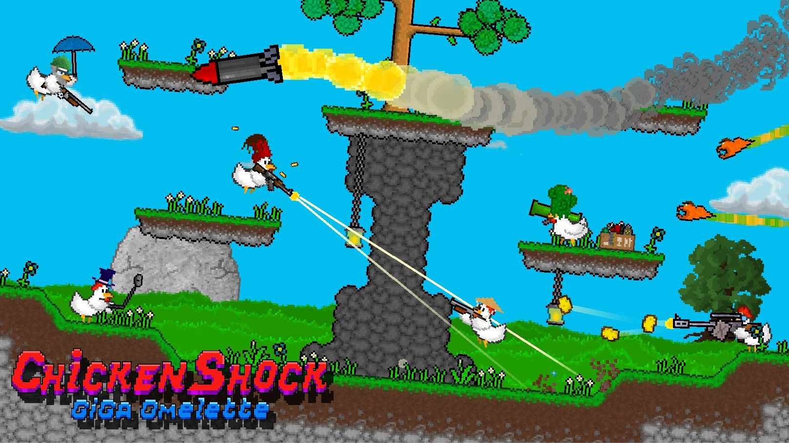
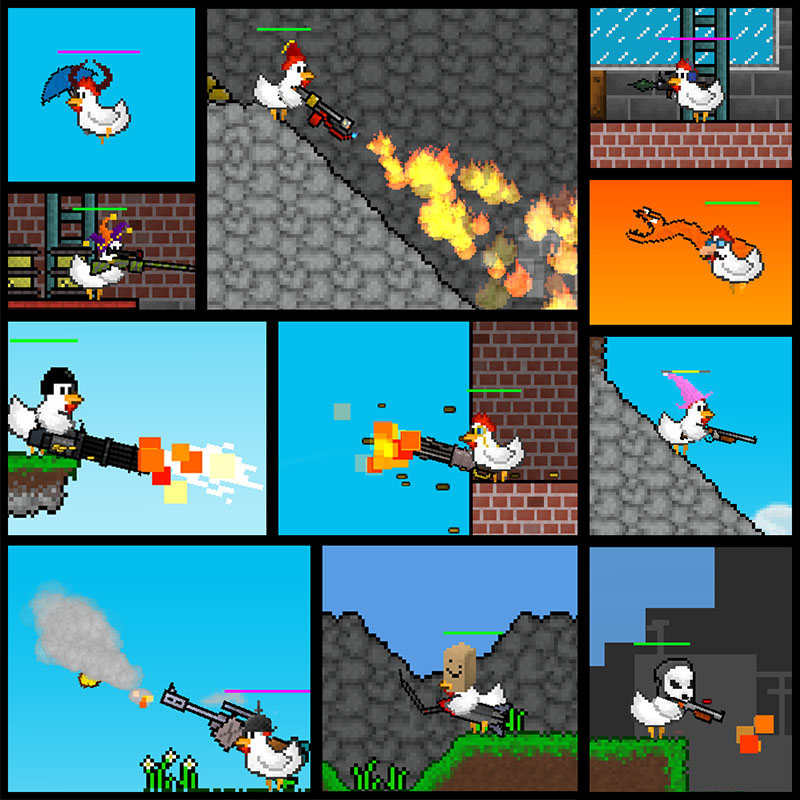
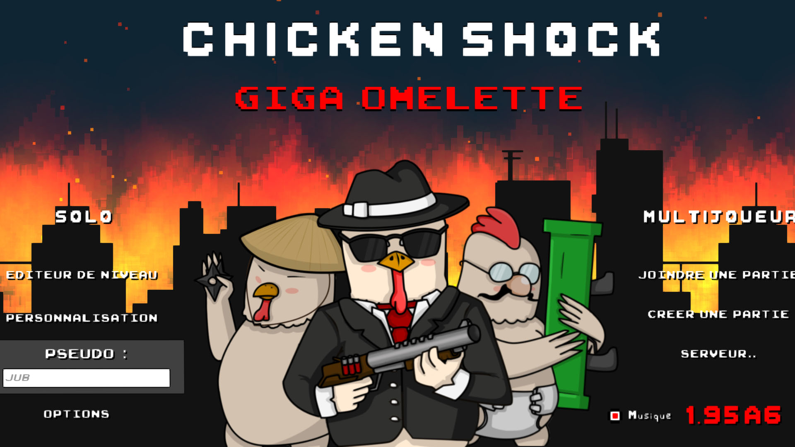

<autotab> <table><thead><tr><th>Date de création</th><th>Ampleur du projet</th><th>Wow effect</th><th>Type de projet </th><th>En Ligne</th></tr></thead><tbody><tr><td>juillet 2016</td><td>xxl</td><td>epic</td><td>Jeu complet</td><td>YES</td></tr></tbody></table></autotab>

## Description

Jeu de tir multijoueur en 2D, avec un rythme trés rapide. Développé en collaboration avec [Maxime BARON](https://www.linkedin.com/in/maxime-baron-3306881a3/) en tant que graphiste.

Jeu publié : [Chicken Shock Giga Omelette by Logiked](https://logiked.itch.io/chicken-shock-giga-omelette)

## Contexte

En première au lycée, 16 ans. L'objectif était de créer un jeu simple, rapide, amusant, mais surtout en multijoueur. Le design avait pour but d'être en 2D, varié dans ses éléments graphiques, ses armes et les skins des joueurs.

## Développement

Le développement fût relativement sans accrocs, sachant que le package Unity2D et les *tile maps* n'existait pas encore à l'époque. Le système de création de map a été developpé sans tutoriels, en se basant uniquement sur la documentation Unity et mes connaissances de l'époque. C'est pourquoi, ca fonctionne bien, mais c'est plutot trés mal codé. N'ayant pas de connaissances préalables sur la *serialization*, la plupart des types de données du jeu sont sérialisés à la main, lignes par lignes, dans mon propre language (Mon dieu et dire que tout ça aurait pu être en Json..). Ca m'a bien servi de leçon. Des années aprés, j'ai apris à chercher sur internet et faire de la veille des solutions existantes.

Un moment j'ai pu me faire une petite initiation aux bases de données avec du SQL. Je voulait faire une page d'acceuil sur le menu principal du jeu avec des informations d'actualités.

## Produit final

3 modes de jeu jouables dans lesquels les joueurs peuvent jouer en équipe ou en FFA. 

33 armes différentes, aux fonctionnalités multiples telle que armes à feu, lance-flammes, et d'autres plus loufoques.

Un éditeur de niveaux pour jouer sur ses cartes personnelles, en multijoueur.

Le jeu est fonctionnel et en ligne, avec une édition achetable qui permet l'accès à l'intégralité des armes et des chapeaux sans passer par des heures de jeux.

## Ressenti

Très content du résultat, avec ses designs créatifs et un gameplay très accessible !

Beaucoup d'apprentissage durant le développement, qui donnait envie de retravailler le code dans un objectif d'optimisation, mais le jeu reste totalement fonctionnel en l'état.

## Mode Histoire

<history>

*[Infos en vrac]*
En collocation avec mon ami graphiste et artiste doué [Maxime BARON](https://www.linkedin.com/in/maxime-baron-3306881a3/), et ayant déjà collaboré sur de nombreux projets, nous avons eu l'idée de développer un jeu en 2D un peu ridicule mais fluide, rapide et amusant, qui nous permettrait de jouer avec notre groupe d'amis et qui s'adresserait à tous les jeunes de notre âge.

L'idée a alors germé d'un jeu en multi où les joueurs pourraient se battre en FFA ou en équipe, en étant des poulets, et en ayant l'occasion d'essayer et débloquer une multitude d'armes aux effets toujours plus destructeurs et loufoques ! 

La première étape a été le développement du système de création et d'édition de map afin d'avoir la possibilité de créer des blocs différents, de les placer, et de sauvegarder leur emplacement pour ensuite pouvoir les utiliser telles quelles lors des combats. L'intégralité des maps de base du jeu ont été aussi créées via ce système, même s'il permet désormais à n'importe quel joueur de créer sa map personnelle. Il faut prendre en compte que le *tile map* n'existait pas encore à l'époque, ce qui aurait évidemment grandement facilité le développement qui s'est fait en s'aidant uniquement de la documentation d'Unity. Dès que la map est enregistrée, l'éditeur peut la reconnaître et le joueur peut jouer dessus seul ou en multi, grâce à une connexion sur le même serveur dans une même room. Je suis d'ailleurs très fier de ce mécanisme !

Afin d'enregistrer les maps et pour un certain nombre d'autres fonctionnalités, je me suis intéressé à la *serialization*. Je n'avais aucunes connaissances sur le sujet mais j'ai tout de même réussi à réaliser mon propre fonctionnement. Seulement j'ai aussi eu l'occasion de réaliser que l'autodidactique avait ses limites : j'ai en effet passé une très longue partie de mon temps à réinventer la roue, en n'utilisant pas les pleines fonctionnalités du moteur et en ignorant que des texte de définition des *game rules* étaient une pratique standard. Petit regret donc pour cette étape qui s'approchait du cauchemardesque, et qui aurait pu être bien plus simple.

La création du menu principal, la création de map et le fait de pouvoir se reconnecter sans avoir à retélécharger le jeu m'ont permis une première approche des bases de données et des requêtes SQL avec le jeu hébégé en local host sur l'ordinateur. Cette première approche m'a bien aidé pour la suite de mes études.

Quelques autres fonctionnalités :

- Système de reward : les armes et chapeaux se débloquent en fonction de tes parties.

- Différents modes de jeu comme l'*instagib* / *oneshot*, les parties en équipe, les mêlées, et le mode où tous les joueurs se battent contre une même entité **Synan** (elle-même pilotée par un joueur).

- 33 armes différents aux capacités multiples et effets surprenants.

L'évolution du jeu a été plutôt longue, car réalisé en parallèle de plusieurs petits projets. Je repassais régulièrement pour des fixs, des ajout d'armes ou des perfectionnement de maps. Au bout de quelques années, le jeu a été publié sur [itch.io](https://logiked.itch.io/chicken-shock-giga-omelette).

Je suis extrêmement fier de ce jeu, qui a eu une très grande popularité au sein de mon DUT et qui a su capter l'attention de ses joueurs pendant plusieurs mois ! Sans aucune autre communication que le bouche à oreilles, la dévotion a fini par s'amenuir mais le potentiel du jeu a été prouvé.

</history>

<nextprojects>

> Projet précédent -  [Demo nuclear](/Jub_Biography/#projects/#DemoNuclear)

> Projet suivant -  [Slender Letard](/Jub_Biography/#projects/#SlenderRetard)

</nextprojects>