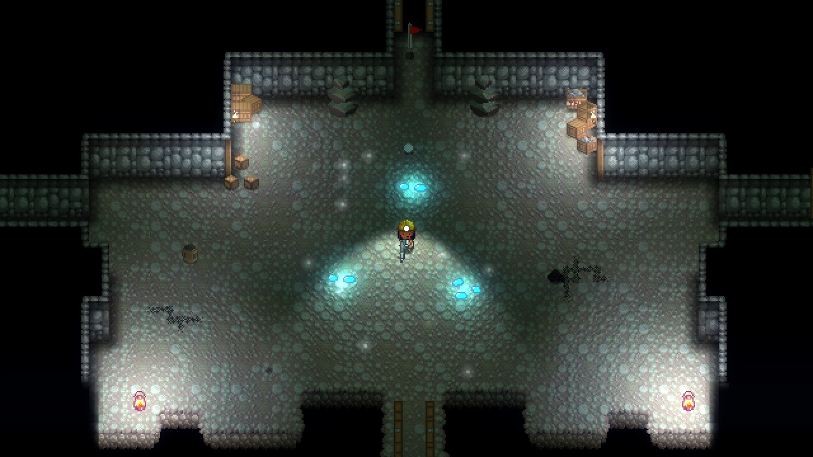
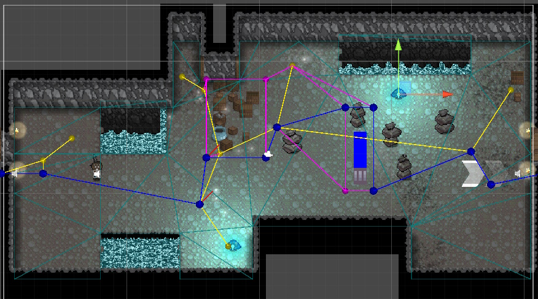
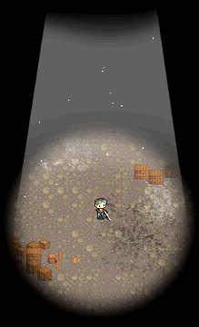
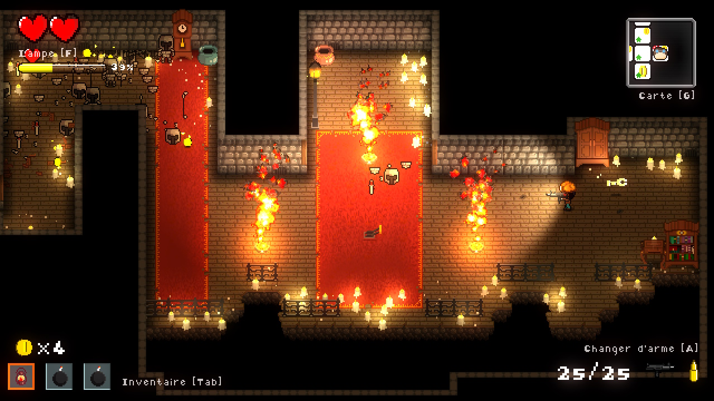

<autotab> <table><thead><tr><th>Date de création</th><th>Ampleur du projet</th><th>Wow effect</th><th>Type de projet </th><th>En Ligne</th></tr></thead><tbody><tr><td>mai 2018</td><td>xxl</td><td>epic</td><td>Jeu complet</td><td>NO</td></tr></tbody></table></autotab>

## Description

Jeu de type "Biding of Isaac" ou "Enter the gungeon", thémé sur la lumière. Une aventure solo, où le joueur progresse dans l'obscurité. Chaque étage est plus sombre et plus dangereux que le précédent !

<iframe width="896" height="504" src="https://www.youtube.com/embed/MPfe4zVcUSw?si=VyH18GPODK-wfj3k&hd=1" title="YouTube video player" frameborder="0" allow="accelerometer; autoplay; clipboard-write; encrypted-media; gyroscope; picture-in-picture; web-share" referrerpolicy="strict-origin-when-cross-origin" allowfullscreen></iframe>

## Contexte

Fin de terminale S. Aprés la franche réussite au sein de notre classe de [ChickenShockGigaOmelette](/Jub_Biography/#projects/#ChickenShock_GigaOmelette), avec Max on décide de se lancer dans une nouvelle aventure ! Le développement d'un roguelike sur le théme de la lumière. 

## Développement

Avec Max, On a énormément travaillé sur le projet en collaboration intense durant les premières années. Comme pour [CSGO](/Jub_Biography/#projects/#ChickenShock_GigaOmelette), il faisait les graphismes et moi le développement (donc je faisait 80% du taff, ahah). Petit à petits, nous sommes chacun parti de notre coté. On avait beau vivre en coloc, entre les études et les autres projets personnels, c'est devenu difficile de se coordonner et de garder une motivation d'équipe. Niveau dev, c'est clairement mon plus gros projet. Enormément d'outils ont été conçu spécialement pour le jeu, à l'époque le package Unity2D pour faire des tilesets ainsi que la pipeline de rendu URP n'hexistaient pas ! Le jeu est donc un bricolage d'optimisation et de solutions techniques sorties de nulles pars. Voici quelques idées des solutions complexes mises en place au seins du jeu :

- Système multilangue & localisation
- Système de positionnemement de salles aléatoires
- Editeur de niveau
- Interface (dans Unity) de création et d'édition de dialogues
- Système de pathfinding intelligent
- Système de réfraction dans de l'eau de certains éléments visibles
- Systèmes d'items, de potions, d'objets qui modifient des stats du joueurs en temps reel
- Système de découpe de sprites et d'animation en 2D, bien plus efficace que celui d'Unity (aujourd'hui remplacé par le package Logiked (aussi développé par moi))
- Système de tutoriels visuel
- Et il y en as encore beaucoup d'autre !

*Pathfinding dynamique pour les entités du jeu*

\
Etant donné que le projet a été commencé lorsque j'avais 17 ans, je n'avais pas encore les connaissances d'aujourd'hui. Il y a donc beaucoup de temps qui a été passé à reconstruire ces outils et à faire des migrations de données du jeu (entre la centaine d'items, de salles, de dialogues, la dizaine de niveaux...) vers quelque chose de plus pratique.

## Produit final

Pour l'instant, on a un projet toujours en cours de développement, cependant, le jeu est jouable ! Il y a plein de niveaux, de boss(s)... Au moins 2h de gameplay facile ! Et ça envoie du lourd.

## Ressenti

Beaucoup de fiérté ! C'est clairement mon projet favori. Souvent les moments où je code se transforment en vraies parties de jeu, et ça, c'est fun.

<nextprojects>

> Projet précédent -  [PaperKata platformer](/Jub_Biography/#projects/#PaperKata)

> Projet suivant -  [Mr. Kata Die It Yoursefl](/Jub_Biography/#projects/#MrKata_DieItYoursefl)

</nextprojects>