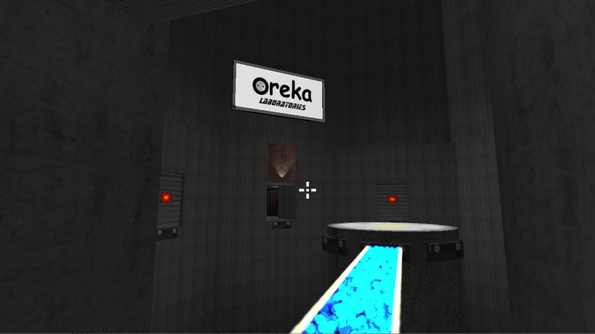
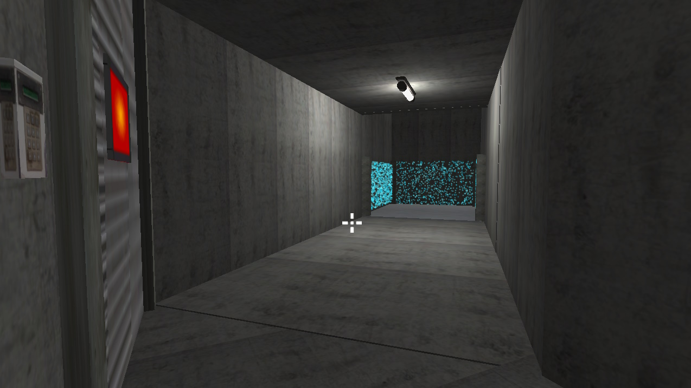
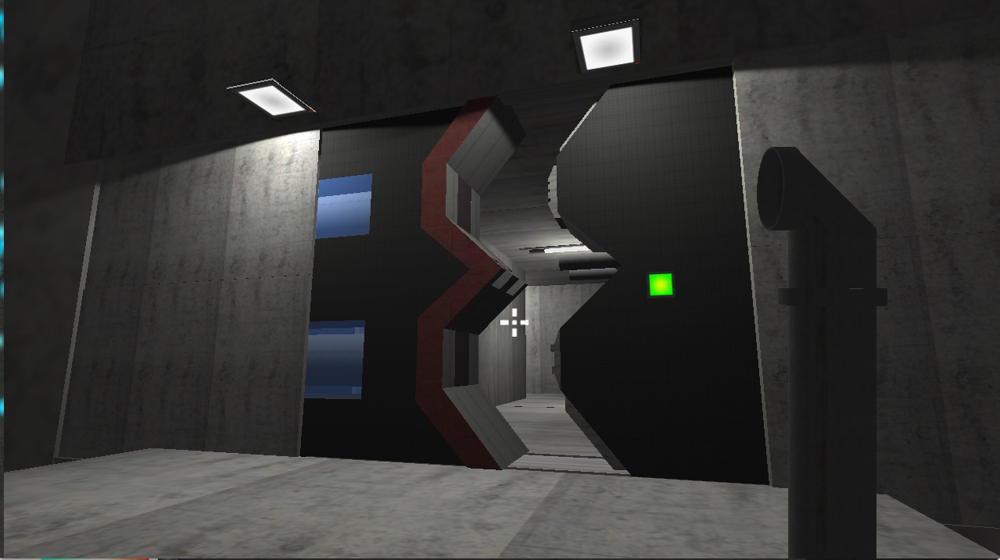

<autotab> <table><thead><tr><th>Date de création</th><th>Ampleur du projet</th><th>Wow effect</th><th>Type de projet </th><th>En Ligne</th></tr></thead><tbody><tr><td>mars 2014</td><td>medium</td><td>null</td><td>Protype jouable</td><td>NO</td></tr></tbody></table></autotab>

## Description

Premier vrai jeu de type FPS dans un monde s'inspirant de l'univers de `Portal`, caractéristique par ses salles et murs en béton, ses labos et une voie off de scientifique ajoutée par mes soins.

## Contexte

A ce stade, je n'avais pas de encore de connaissances solides dans le développement, ainsi n'y a-t-il pas de logique complexe ni de scripts.
Après avoir tapé sur internet "comment faire un jeu en javascript" et m'y être employé au cours de l'année entre mars 2014 et mai 2015, j'ai pu entrevoir ce nouveau monde de possibilités infinies !

## Développement

Le but était d'explorer un large panel des éléments classiques de Game Design : apprendre la gestion des sons (musiques, effets sonores), créer des particules, des triggers, des animations, etc.
Tout le développement s'est effectué en JavaScript.

## Produit final

Le produit final comporte un menu principal, et un enchaînement de quelques scènes reliées ensemble par un ascenseur permettant de passer de l'une à l'autre.

Le jeu est jouable, et a une durée de vie d'environ 10 minutes avec un gameplay centré autour de mécaniques simples et des énigmes.

## Ressenti

J'ai extrêmement apprécié cette période de développement, et les résultats auxquels j'ai abouti ! Tout était extraordinaire, et je ne compte pas les heures passées sur ce jeu durant mon collège, toujours motivé à faire fonctionner une nouvelle idée.

Je suis encore aujourd'hui fier de ce premier jeu et me souviens aussi de l'aperçu du vaste champs des possibilités que me permettait Unity et mon imagination.

## Mode Histoire

<history>

Dans le domaine du jeu vidéo, j'avais déjà l'habitude d'être actif en tant que joueur, mais aussi dev ! En effet, je modais souvent les jeux auxquels je jouais, j'importais des modèles 3D et d'une manière générale, j'adaptai les jeux en les faisant se rapprocher le plus possible de ma vision idéale ou en leur ajoutant mes idées.

Il m'est venu à l'esprit que si je modifie les jeux à chaque fois, c'est que le développement direct de jeu m'est accessible !

Lors de mes recherches à l'époque, c'était le moteur de jeu **Unity** qui semblait être la meilleure plateforme. Je m'essayai alors à une multitudes de petits projets de tests et d'implémentation de fonctionnalités simples afin de comprendre le fonctionnement du moteur (Player Controller, les input pour se déplacer, la gestion des sons...). Très rapidement, et au lieu de commencer par un petit jeu, je décide de me lancer dans `Oreka`, un jeu qui regrouperai toutes mes envies de l'époque. J'avais un très grande motivation : mon jeu serait un mix de `Portal` et `Half Life`. Il permettrai au joueur de passer en salle en salle, d'obtenir des armes, d'activer des mécanismes, de résoudre des énigmes, etc, tout en permettant d'évoluer dans un environnement immersif.

Avec rien de déterminé ou placé sur papier, je me lance dans le développement tête baissée mais les idée plein la tête. Mon approche était visuelle : loin de moi l'idée d'optimiser quoi que ce soit, dès la première trace d'un semblant de réussite, j'utilisai la fonctionnalité pour le reste du jeu et continuai d'implémenter toujours plus de nouvelles choses. Bien entendu à l'époque, des listes d'exeptions en rouge était très régulieres.

Pour ce qui était des designs, la technologie utilisée étaient *Google Sketchup* pour les modèles 3D, tels que les tuyaux, les armes, la porte (visible dans le screen suivant), etc.

J'ai arrêté le développement du jeu en fin de quatrième, après avoir codé pendant un an sans m'arrêter (à part pour d'autres projets annexes). Cette première vraie approche d'**Unity** m'a permise de me familiariser avec un grand nombre de fonctionnalités de base : un début de système de jeu en FPS (armes, pouvoir frapper avec, faire des dégâts aux ennemis), la gestion des sons, de ma voix, des animations, l'utilisation des particules.

Mes connaissances de la programmation restaient basiques, mais j'étais dans une période de foisonnement d'idée, je voulais tout faire, et tout en même temps ! J'étais très fier de ce jeu, qui était jouable, intéressant, et qui collait parfaitement à l'esthétique prévue. **Unity** et le développement de jeux vidéos ont été une découverte qui a changé ma vie (Violons, Rideau. Sah quel théatre !).

</history>

<nextprojects>

> Projet précédent -  [Jeu baston 2D](/Jub_Biography/#projects/#Baston2D)

> Projet suivant -  [Slender 1.0](/Jub_Biography/#projects/#Slender1)

</nextprojects>
