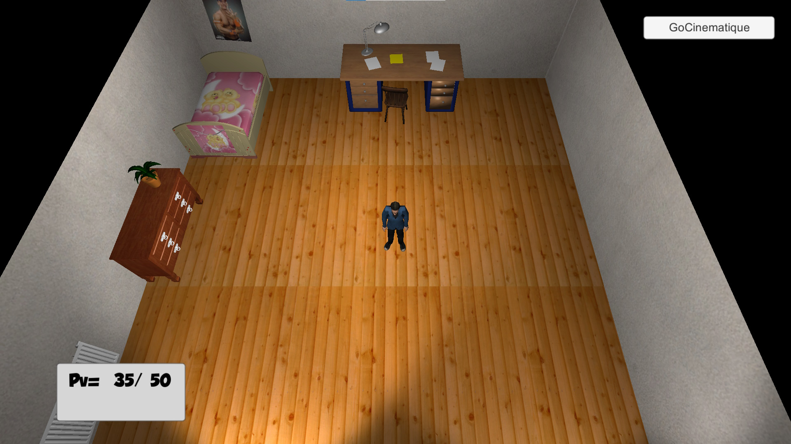
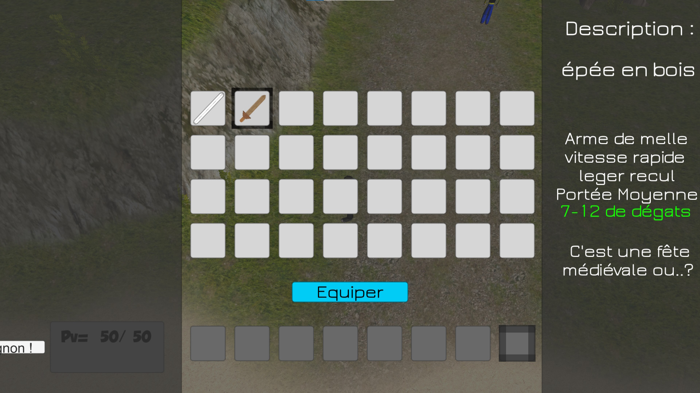

<autotab> <table><thead><tr><th>Date de création</th><th>Ampleur du projet</th><th>Wow effect</th><th>Type de projet </th><th>En Ligne</th></tr></thead><tbody><tr><td>février 2016</td><td>small</td><td>null</td><td>Prototype court</td><td>NO</td></tr></tbody></table></autotab>

## Description

RPG en 3D, avec certains éléments de l'histoire similaires au [RPG 2D](/Jub_Biography/#projects/#RPG2D).

## Contexte

Aprés avoir réalise le prototype [RPG 2D](/Jub_Biography/#projects/#RPG2D), je me suis questionné sur la simplicité du développement d'un jeu similaire en 3D. Ca ne devait pas être si compliqué. 

## Developpement

Ce projet m'a permis de m'initier à Blender en modifiant des modèles 3D préexistants en les transformant en des imitations de mes professeurs de l'époque. Le joueur pouvait interagir avec les PNJ et initier des dialogues. Les PNJs pouvaient se déplacer et regarder le joueur. J'ai apris a faire des `rigs` rudimentaires, pour les modèles 3D n'étants pas articulés.

Après avoir commencer à coder le système de combat, je me suis lassé du projet, surtout quand l'idée bien plus intéressante de mon prochain projet m'est parvenue....

<nextprojects>

> Projet précédent -  [Kata's minigames](/Jub_Biography/#projects/#MrKataMinigames)

> Projet suivant -  [Super Gun Fight](/Jub_Biography/#projects/#SuperGunFight)

</nextprojects>