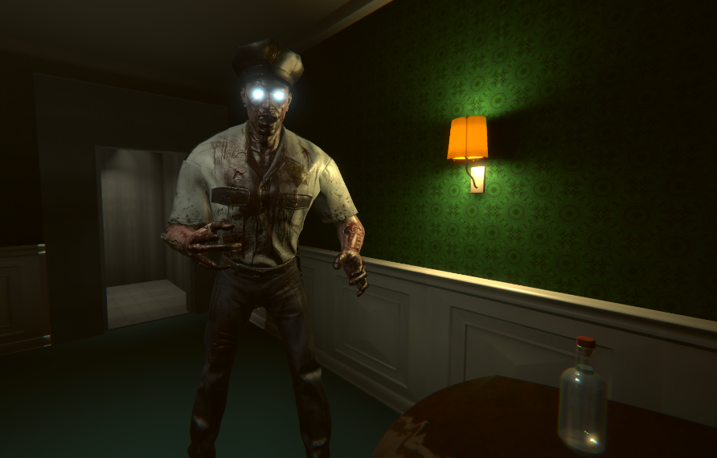
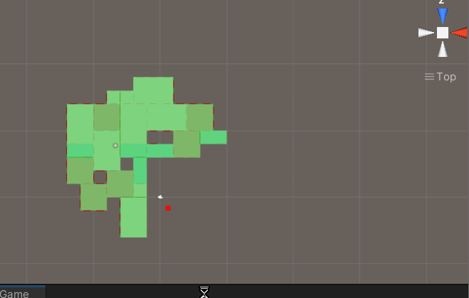
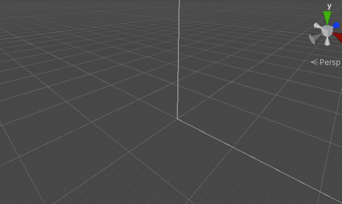
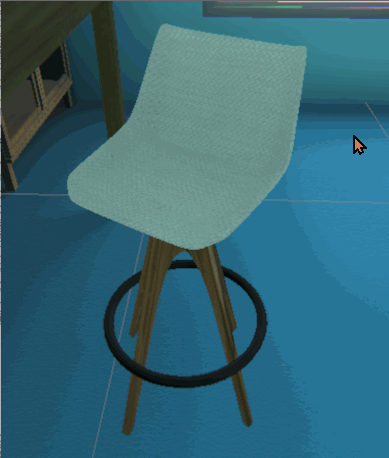
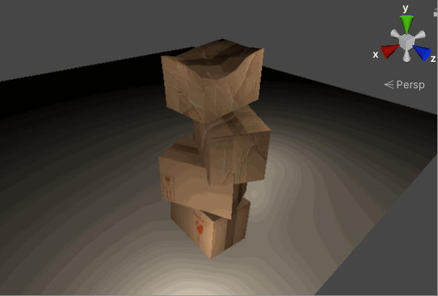
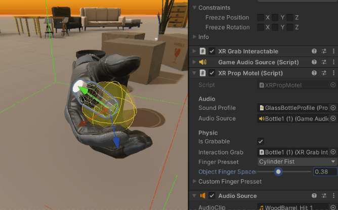
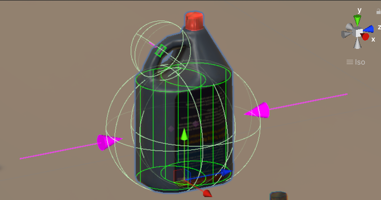
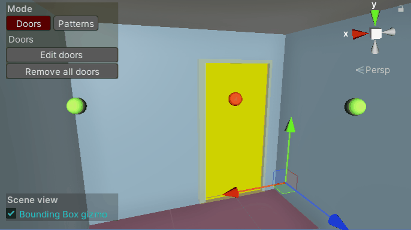
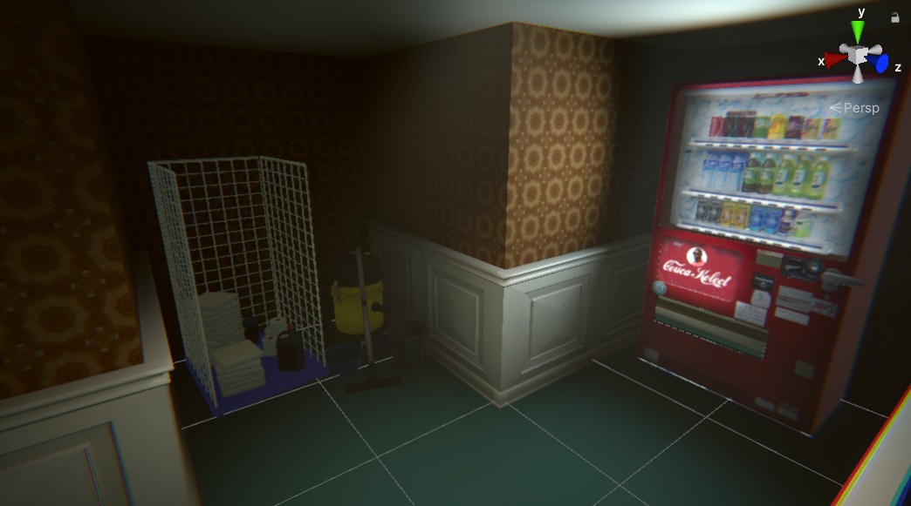
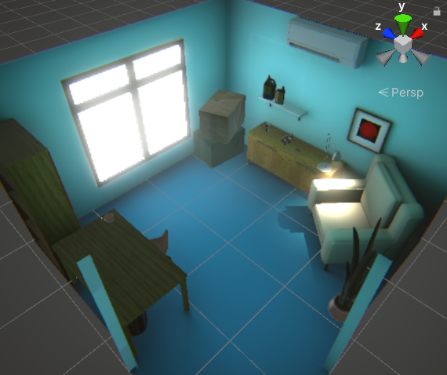

<autotab> <table><thead><tr><th>Date de création</th><th>Ampleur du projet</th><th>Wow effect</th><th>Type de projet </th><th>En Ligne</th></tr></thead><tbody><tr><td>octobre 2021</td><td>large</td><td>very cool</td><td>Protype jouable</td><td>NO</td></tr></tbody></table></autotab>

## Description

Room 505 est un jeu d'exploration et d'horreur multijoueur en VR. Les joueurs doivent s'échaper d'un hotel, en cherchant des objets et des indices dans les chambres.

<iframe width="896" height="504" src="https://www.youtube.com/embed/sOHHD-aJkuQ?si=xSddC2NbXiyy4RhD&hd=1" title="YouTube video player" frameborder="0" allow="accelerometer; autoplay; clipboard-write; encrypted-media; gyroscope; picture-in-picture; web-share" referrerpolicy="strict-origin-when-cross-origin" allowfullscreen></iframe>

## Contexte

Projet en équipe de 6. Développé en tant que projet de fin d'année de notre 4éme année d'études supérieur, à l'ESIEE paris. On avait le choix entre plusieurs projets différents, mais un énième projet sur Unity, on a sauté sur l'occasion !

## Développement

En tout premier, beaucoup de brainstormings. Quel type de jeu ? Quel ambiance ? Rapidement l'idée du jeu en VR multi est apparue. Etant le plus à l'aise sur Unity, j'ai été un peu la plus grande force de proposition, bien que je n'étais pas le chef de projet. Ainsi on voulait faire une map qui puisse de générer de manière procédurale histoire que chaque run soit différente. En fait j'avais déja développé un package permettant du positionnement de salle, un peu comme dans [LackOfLight](/Jub_Biography/#projects/#LackOfLight). C'était un avantage.

<imagegroup></imagegroup>

*Placement procédural de salles*

Il y a eu une grande période de veille informatique, notement au niveau du choix de la render pipeline : URP ou HDRP ? De toute manière, le jeu ne pourrais pas tourner sur un casque VR type Quest, et devrait forcément etre streamé depuis un ordinateur. Aprés pas mal de tests et de recherches, HDRP à beau donner des résultats magnifique, ce n'était absolument pas optimisé pour de la VR.

Au début j'ai beaucoup travaillé à mettre en place les technos et types de données à utiliser. Assez rapidement on a eu un système de génération rudimentaire et des méthodologies pour l'ajout de nouveaux élèments dans le jeu. On s'est répartis des taches et on faisait des réunions et comptes rendus hebdomadaires. A chaque fois, des objectifs étaient fixés pour la fois d'aprés : Créer une nouvelle salle, une nouvelle entité, trouver des nouveaux props sur internet (objets 3D) et leur donner de la physique...

<imagegroup></imagegroup>

*Props implémentés dans le jeu*

Ce développement se passe 1 ans aprés la sortie de `Half-Life:Alyx`. Ce que j'ai trouvé d'incroyable dans ce jeu est la sensation d'immersion. Les interactions qu'on a avec l'environement sont tellement "sensibles"... Par là j'entends tous les petits détails liés à la manipulation d'objets dans le jeu. Par exemple les micro-vibrations ressentis dans les manettes, ou le placement des doigts sur les objets, qui est le même que celui sur les manettes. La plupars des plugins permetant d'offrir ce niveau de détail en VR étant payants, je me suis lancé dans le développement notre propre plugin. Ce plugin permetait de gérer les points d'attrape des objets, la dispositions des doigts ainsi que leur sons (quand il touchent le sol ou quand ils sont secoués).

<imagegroup></imagegroup>

*La saisie des éléments dans le jeu*

Afin d'aider l'équipe à développer, j'ai conçu beaucoup d'outils sur Unity (pour créer des salles, simplifier la création de props attrapables, créer des dialogues..). J'ai posté aussi un certain nombres de tutoriels sur le discord du projet afin d'expliquer les bonnes pratiques.

<imagegroup></imagegroup>

## Produit final

Pour toute l'équipe, ça aura été du sacré boulot. Les plus investis ont beaucoup apris sur Unity, des connaissances qui leur sera peut-être utile pour leur avenir. On est vraiment fier de ce qu'on a produit, même si l'ampleur du projet était un petit peu démeusuré. Par exemple, on a jamais pu commencer la feature du multijoueur ! Le projet finira à l'état de prototype, mais avec de trés jolis designs et élèments de gameplay sympas ! Récement l'équipe voulait s'y remètre afin d'essayer de le commercialiser. 

## Ressenti

Extremement content du résultat. Extremement déçu de la soutenance : 7 minutes. C'est le temps que chaque équipes avait pour vendre son projet, effectué sur 1 ans. Ce n'était vraiment pas sérieux, et c'est bien domage. On avait tellement de choses à dire sur ce gigantesque morceau !

<video width="640" height="360" controls>
  <source src="/Jub_Biography/Projects/Room505/./medias/portal.mp4" type="video/mp4">
</video>

## Infos supplémentaires
<history>
C'est seulement en cours de développement qu'on a remarqué : entre les lightmaps, les modèles 3D super réalistes, les jeu de lumières volumétrique, on commencait sérieusement à tendre vers un design photoréaliste. Le photoréalisme, c'est le pire ennemi des développeurs indés ! C'est un design qui nescessite beaucoup d'entretient et qui est assez chronophage niveau conception. 
</history>

<nextprojects>

> Projet précédent -  [Robot industry V2](/Jub_Biography/#projects/#Robotindustry)

> Projet suivant -  [Eatstone](/Jub_Biography/#projects/#Eatstone)

</nextprojects>