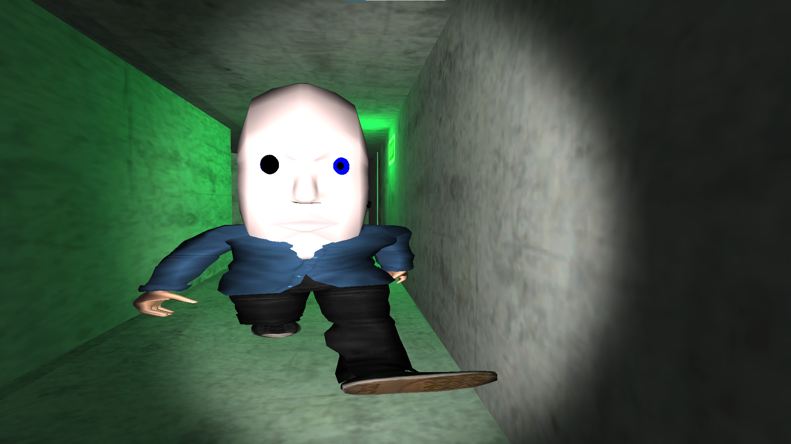
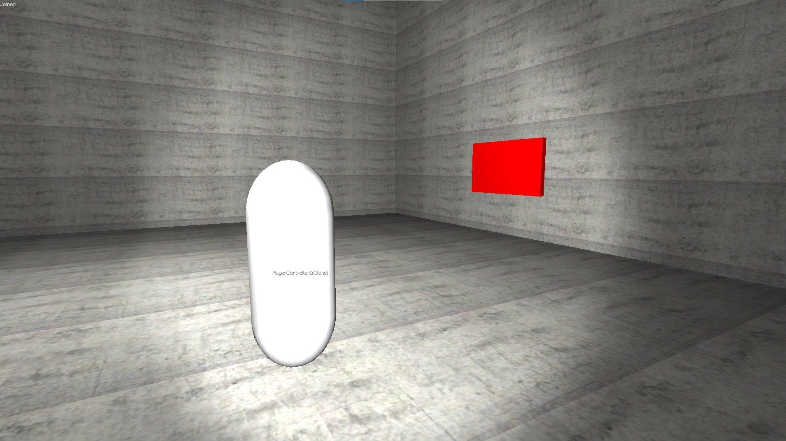

<autotab> <table><thead><tr><th>Date de création</th><th>Ampleur du projet</th><th>Wow effect</th><th>Type de projet </th><th>En Ligne</th></tr></thead><tbody><tr><td>octobre 2014</td><td>small</td><td>null</td><td>Jeu alpha / incomplet</td><td>NO</td></tr></tbody></table></autotab>

## Description

Un jeu de type slender, avec un monstre qui vous poursuit dans des couloirs.

Cette période était une période de tests et d'essais sur Unity. Je voulais implémenter mes envies en terme de gameplay et de types de jeu L'objectif ici était de faire un monstre qui se déplace de manière autonome. Il se téléporte de manière aléatoires, et déambule dans l'espace où le joueur se trouve. Le joueur doit s'échapper du mini labyrinthe en trouvant une clé puis en rejoignant la sortie, et ce sans se faire attraper par le monstre qui le course au premier regard !

Ce fût mon début avec C#, puisque le projet m'amenait à recoder un script JS en C#. La syntaxe étant similaire, j'ai donc juste utilisé le retourn du compileur pour passer d'un langage à l'autre. Pas de tutoriels ou de documentation, juste de la déduction logique et de l'observation de ce qui marchait ou non.

Les essais de multijoueur étaient assez instables. Essayant de comprendre comment fonctionnait la librairie `Photon Network`, sans connaissances au préable. Plus tard ce projet `Slender 1.0` sera merge avec merge, [Steel BulletFury](/Jub_Biography/#projects/#SteelBulletFury)

*Test de multijoueur (la capsule est un second joueur)*

<nextprojects>

> Projet précédent -  [Oreka](/Jub_Biography/#projects/#Oreka)

> Projet suivant -  [Goblinville FPS](/Jub_Biography/#projects/#Goblinville)

</nextprojects>