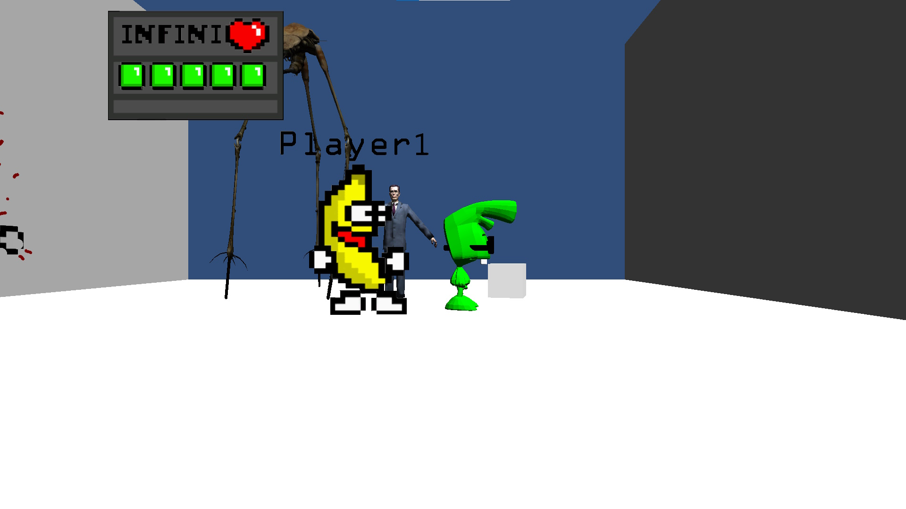

<autotab> <table><thead><tr><th>Date de création</th><th>Finalisation</th><th>Ampleur du projet</th><th>Wow effect</th><th>Type de projet </th><th>En Ligne</th></tr></thead><tbody><tr>
        <td>mars 2013</td>
        <td>mars 2013</td>
        <td>ultra small</td><td>null</td>
        <td>Prototype court</td><td>NO</td>
        </tr></tbody></table></autotab>

## Description

Prototype d'un jeu de baston.

Le but était de s'inspirer de jeux tels que `Street Fighter` ou `Smash Bros.`. Le projet comporte la plupart des éléments de gameplay : frapper son adversaire, prendre des coups, perdre de la vie, mourir, respawn etc.
C'est mon tout premier projet. Un test rapide des fonctionnalités du moteur. J'avais 13 ans.

<nextprojects>

> Projet suivant -  [Oreka](/Jub_Biography/projects/Unity/Oreka)

</nextprojects>