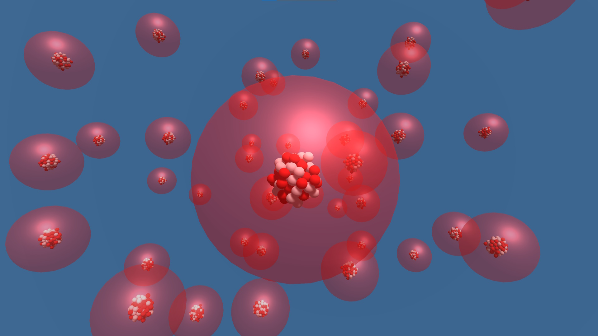
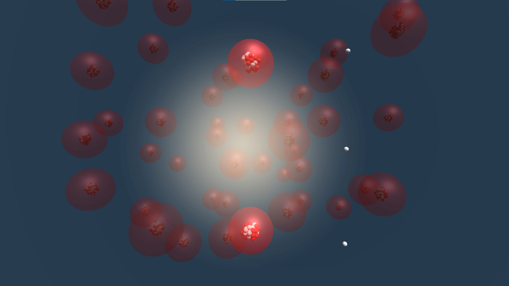
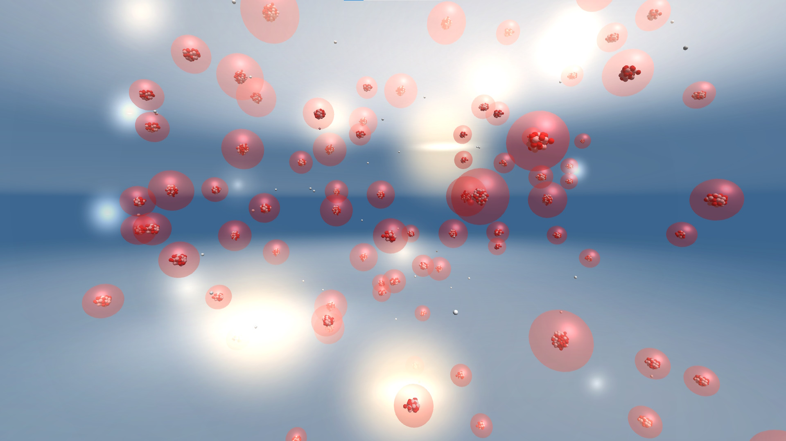

<autotab> <table><thead><tr><th>Date de création</th><th>Finalisation</th><th>Ampleur du projet</th><th>Wow effect</th><th>Type de projet </th><th>En Ligne</th></tr></thead><tbody><tr>
        <td>avril 2016</td>
        <td>mai 2016</td>
        <td>ultra small</td><td>cool</td>
        <td>Prototype court</td><td>NO</td>
        </tr></tbody></table></autotab>

## Description

C'est une animation 3D du fonctionnement de la fission nucléaire.

## Contexte

Le projet à été fait pour la préparation du projet TPE de ma première SI. Le sujet devait couvrir les deux thèmes suivants : Technologie & Energie.

J'ai donc réalisée l'animation d'un atome se faisant percuter par un neutron et déclenchant une réaction en chaîne : les répercussions de l'impact sont potentiellement infinies. Le rendu visuel correspond bien à mes attentes, et le développement était simple et rapide.

## Mode histoire

<history>

C'était l'époque de la période de la construction d'une enceinte / dôme autour des réacteurs nucléaires de Tchernobyl, et le sujet permettait de toucher à l'énergie en expliquant la fission, le fonctionnement du nucléaire, la catastrophe, et de toucher à la technique en expliquant les technologies utilisées pour se protéger des radiations.

Mais au niveau lycée, il est facile de commencer à utiliser de plus en plus de termes scientifiques complexes à expliquer et à faire comprendre. En recherche d'aides visuelles telles que des schéma, animations, mini-films, etc, la conclusion était de le faire nous même. Et puis Unity, je gére, donc c'est allé vite!

</history>

<nextprojects>

> Projet précédent -  [Super Gun Fight](/Jub_Biography/projects/Unity/SuperGunFight)

> Projet suivant -  [Chicken Shock Giga Omelette](/Jub_Biography/projects/Unity/ChickenShock_GigaOmelette)

</nextprojects>