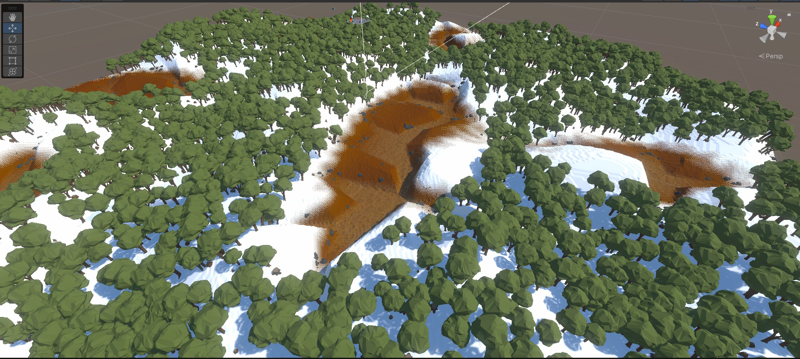
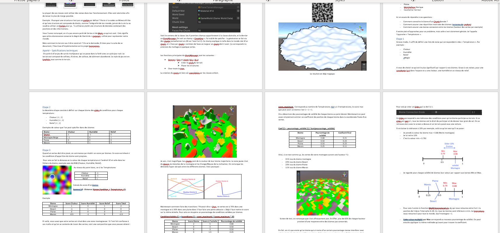
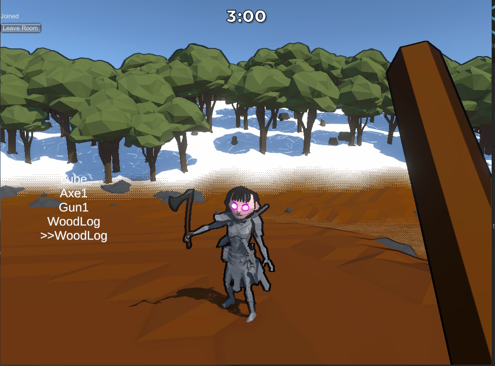

<title></title>

## Description

Eastone est un prototype de jeu de survie multijoueur, avec un rythme rapide. Les joueurs apparaissent dans une map enneigée. Ils ont 3 minutes pour se serrer les coudes, trouver armes & nourriture avant la tombée de la nuit. 

<autotab></autotab>

## Developpement

Ce jeu implémente une génération de terrain utilisant des Noises. Toute cette partie du projet est venue agrémenter la bibliothèque de package LOGIKED. Une documentation sur les techno et les types de données utilisés a été réalisée.

Le multijoueur a été implémenté par la technologie `Photon PUN`.

Il y a eu un soins particulier sur le PlayerController, qui est très abouti. On a des animations réactives qui fonctionnent très bien en multijoueur.

<video width="640" height="360" controls>
  <source src="/Jub_Biography/Projects/Unity/Eatstone/./medias/eatstone.mp4" type="video/mp4">
</video>

<history>
Un système complexe au niveau du réseau a été mis en place. Il fallait pouvoir interragir en multijoueur avec des entités générés procéduralement (comme des arbres, cailloux, etc). Pareil avec les entités générés au cours du jeu, un objet posé au sol par un joueur par exemple, qui doit être visible et disponible pour tous les autres joueurs. Pareil pour un nouveau joueur qui se connecte en pleine game !

 Pour ce faire, un système de "trames réseaux" à été mis en place. L'intégralité des créations et modifications des objets sont stoqués dans une listes, jusqu'a leur destruction. Lorsqu'un nouveau joueur se connecte, le master envoie aux cliens une update de cette liste d'actions. Le client peut alors executer toutes les actions afin d'avoir un jeu à jour.

</history>

## Au Final
- Le multijoueur fonctionne très bien
- La génération est assez incroyable et flexible
- Un super système d'objets qui fonctionne en multi-joueur (prendre, lacher, utiliser)

<nextprojects></nextprojects>