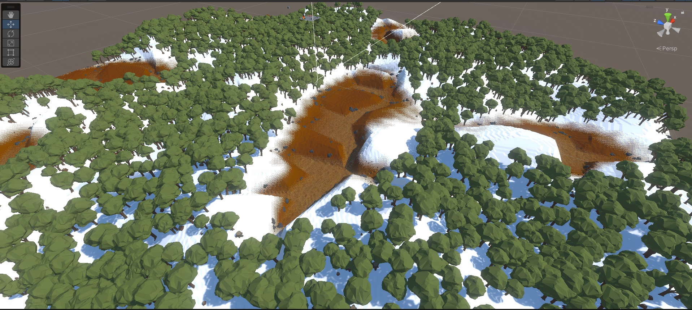
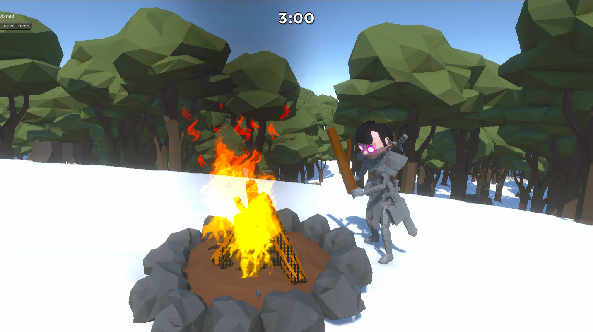
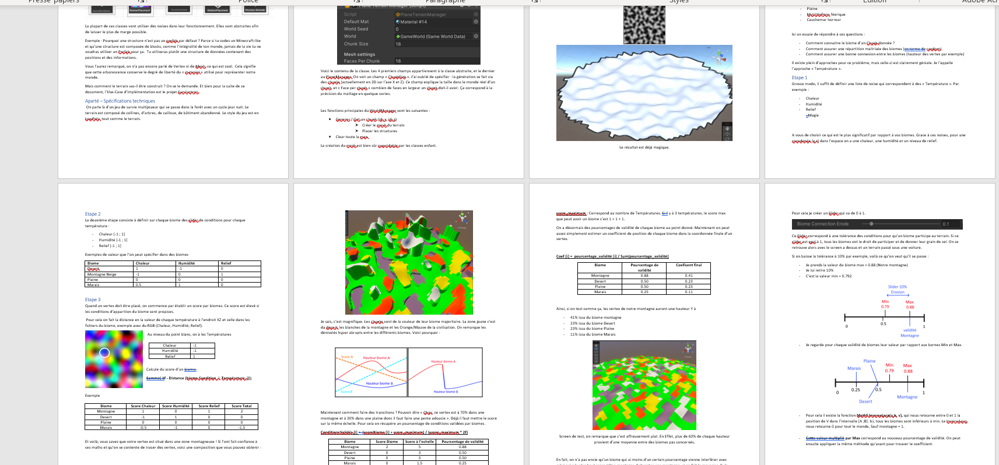
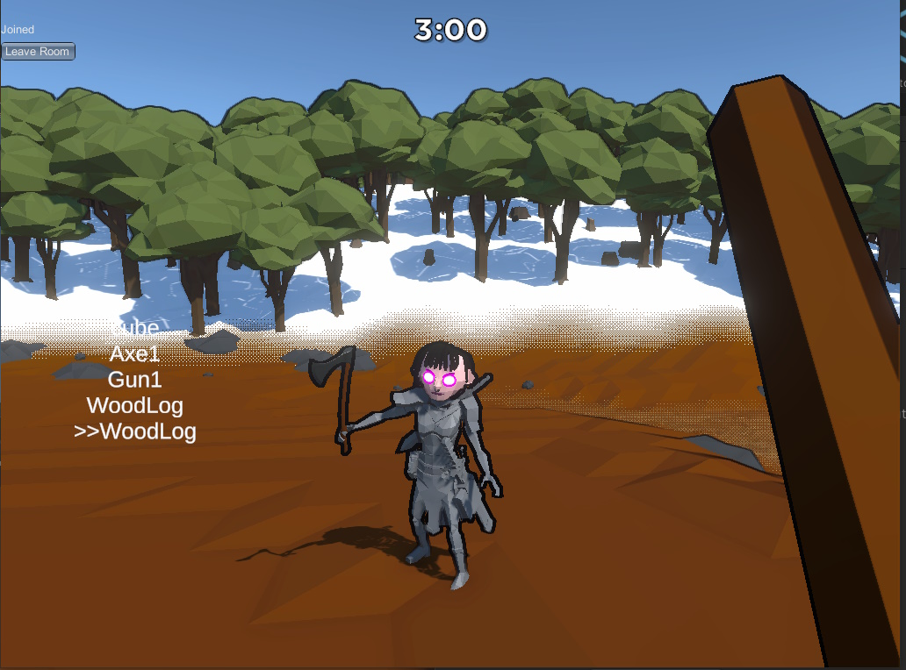

<autotab> <table><thead><tr><th>Date de création</th><th>Finalisation</th><th>Ampleur du projet</th><th>Wow effect</th><th>Type de projet </th><th>En Ligne</th></tr></thead><tbody><tr>
        <td>décembre 2022</td>
        <td>août 2024</td>
        <td>medium</td><td>very cool</td>
        <td>Prototype jouable</td><td>NO</td>
        </tr></tbody></table></autotab>

## Description

Tous les joueurs appaissent dans une map eneigée. Ils ont 3 minutes pour se serrer les coudes, trouver armes & nourriture avant la tombée de la nuit. Eastone est un prototype de jeu de survie multijoueur, avec un rythme rapide.  

## Contexte

En école d'ingénieur, on avait trés peu de devoirs et de contraintes. Les cours était d'une simplicité extreme (lorsqu'on avait cours). Il fallait bien s'occuper ! 

## Developpement

Ce jeu aura surtout été une manière de créer un package logiked que je voulais faire depuis longtemps : Un package de génération de terrains et de Noises. J'ai réalisé beaucoup de documentation sur les techno et les types de données utilisés :

Le multijoueur a été implémenté par la technologie `Photon PUN`, que j'ai souvent utilisé. Cependant, je travaille actuellement sur ma propre solution réseau afin de me séparer de cette dépendance. 

Il y a eu un soins particulier sur le PlayerController, qui est trés abouti. On a des animations réactives qui fonctionnent trés bien en multijoueur.

<video width="640" height="360" controls>
  <source src="/Jub_Biography/Projects/Unity/Eatstone/./medias/eatstone.mp4" type="video/mp4">
</video>

## Mode histoire

<history>
Un système complexe au niveau du réseau à été mis en place. Il fallait pouvoir interragir en multijoueur avec des entités générés procéduralement (comme des arbres, cailloux, etc). Pareil avec les entités générés au cours du jeu, un objet posé au sol par un joueur par exemple, qui doit être visible et disponible pour tous les autres joueurs. Pareil pour un nouveau joueur qui se connecte en pleine game !

 Pour ce faire, un système de "trames réseaux" à été mis en place. L'intégralité des créations et modifications des objets sont stoqués dans une listes, jusqu'a leur destruction. Lorsqu'un nouveau joueur se connecte, le master envoie aux cliens une update de cette liste d'actions. Le client peut alors executer toutes les actions afin d'avoir un jeu à jour.

</history>

## Au Final
- Le multijoueur fonctionne trés bien
- La génération est assez incroyable et flexible
- Un super système d'objets qui fonctionne en multijoeur (prendre, lacher, utiliser)

<nextprojects>

> Projet précédent -  [Projet VR ESIEE 
Room 505](/Jub_Biography/projects/Unity/Room505)

</nextprojects>