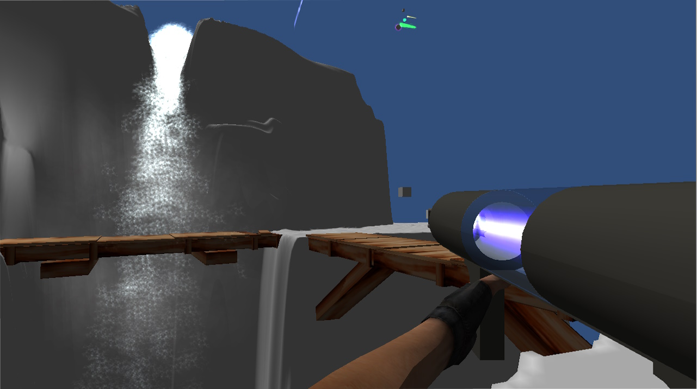

<title></title>

<autotab></autotab>

## Description

Projet de test afin d'effectuer une première approche des FPS en réseau.

Pour ce faire, la librairie native de unity **Unet** a été utilisée. 

Le résultat de ce test est composé d'une seule scène, avec un design ultra collineux afin de représenter une grotte, sensée représenter un univers du du Seigneur des Anneaux. Deux utilisateurs pouvaient se connecter en même temps, mais le projet resta à l'état de prototype m'aillant permis de découvrir la librairie **Unet**.

<nextprojects></nextprojects>