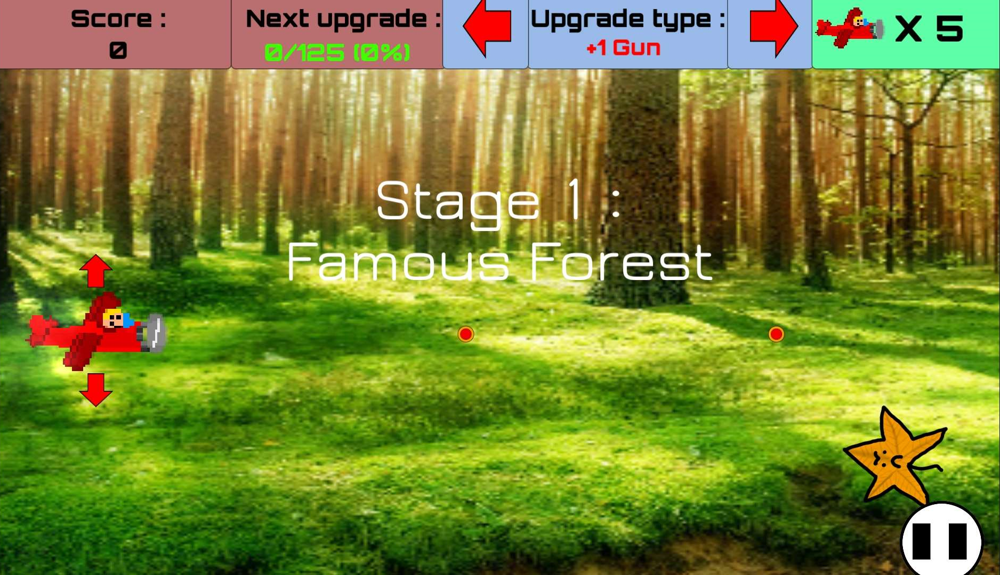
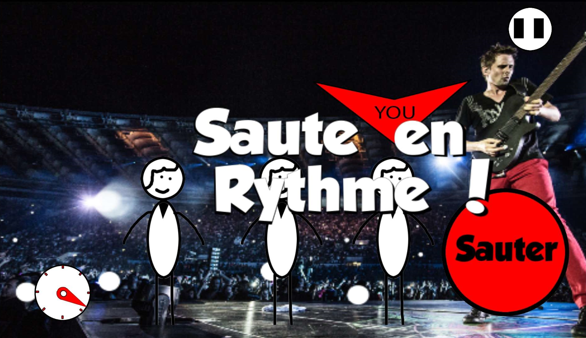
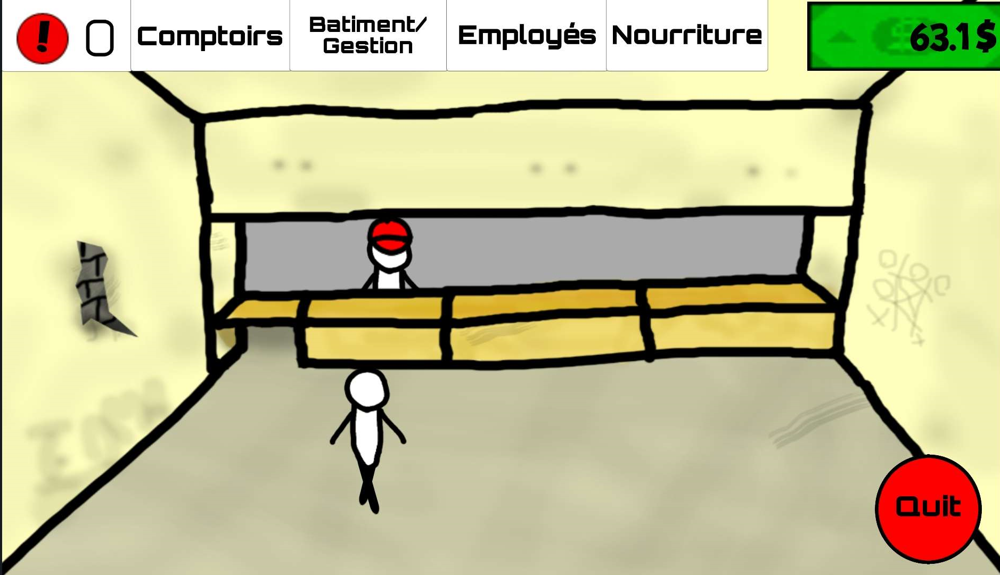

<title></title>

*Screen ingame du shoot-them-up*

## Description

Jeu mobile permettant d'accéder à 4 modes de jeux :
- Jeu de type `Shoot-them-up`, où on dirige un avion qui doit tirer sur des ennemis, arrivant par le scrolling de l'écran,
- Série de mini-jeux sur qui s'enchaînent de plus en plus rapidement,
- Jeu simple de gestion de restaurant.
- Un prototype de jeu multijoueur.

<autotab></autotab>

## Contexte

J'ai lancé ce projet afin de monter en compétences coté développement d'applications mobile, n'ayant jusqu'alors que travaillé sur des jeux PC.

Une forte envie de créer un jeu similaire à `Warioware`, dont l'ambiance et le dynamisme des mini-jeux m'avait marqué. C'est d'ailleurs une musique d'un `Warioware` qui a été utilisé dans ce projet. Quand à Mr.Kata, c'est un personnage que j'ai inventé quand j'étais enfant, dans une bande dessinée. Personnage qui me suivra dans mes créations par la suite. 

## Développement

J'ai du me plonger dans le monde des installation d'Android SDK, de JRE, de JDK, blabla... Sacré rigolade. Le développement a commencé par les mini-jeux, qui finiront au nombre de quinze jeux d'une durée chacun d'environ 4 secondes. Ca paraît court, mais promis, c'est super fun ! Aprés ça, j'ai cherché de nouvelles dynamiques à implémenter.

*Screen ingame d'un minijeu*

Le "Shoot them up" arriva. En réalité, c'est une versione ammélioré d'un mini jeu, j'en ai fait un élèment à part. J'ai créer plein d'ennemis différents, boss aux avec des pattern de tirs spécifiques et des décors sympatiques. On doit avoir une dizaine de minutes de jeux, si le joueur arrive a ne pas mourrir (peu probable). Environ une demi-heure d'amusement à tout casser, donc !

La dernière étape fût un test de jeu de gestion, un restaurant où il faut gêrer employés, clients, stocks et matériel. Jamais abouti.

## Produit final

UI rudimentaire, mais bonne UX, type de jeux parfaitements addaptés à la plate-forme.

Pour le ShootThemUp : Une ambiance amusante par la présence d'images trouvées sur le net en background, avec un enchaînement fluide et agréable des niveaux.

Le jeu de gestion ne sera jamais abouti, bien de de nombreuses features ont déja été implémentés.

*Le jeu de gestion*

## Ressenti

Une montée en compétences dans beaucoup de domaines et une découverte des différents frameworks nescessaires pour faire un jeu mobile Android sur Uniy. Mes tests se transformaient régulièrement en longues parties de jeux, sur plusieurs plateformes différents pour tester les performances. Jamais mis en ligne, mais distribué à beaucoup de proches, qui, pour certaines, y jouent encore de temps à autre.

<nextprojects></nextprojects>
