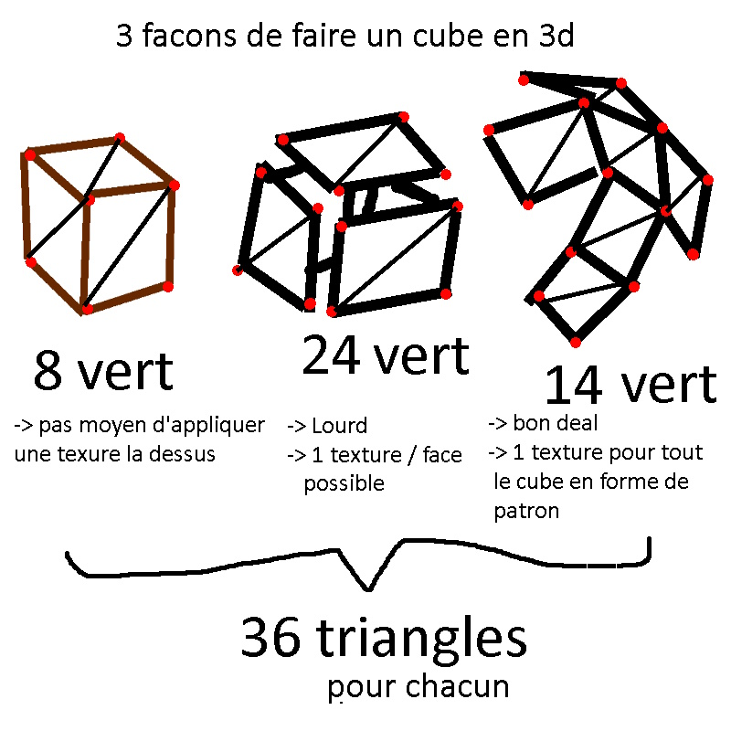
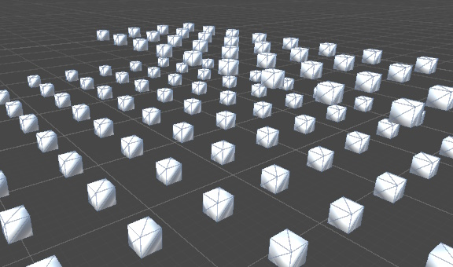
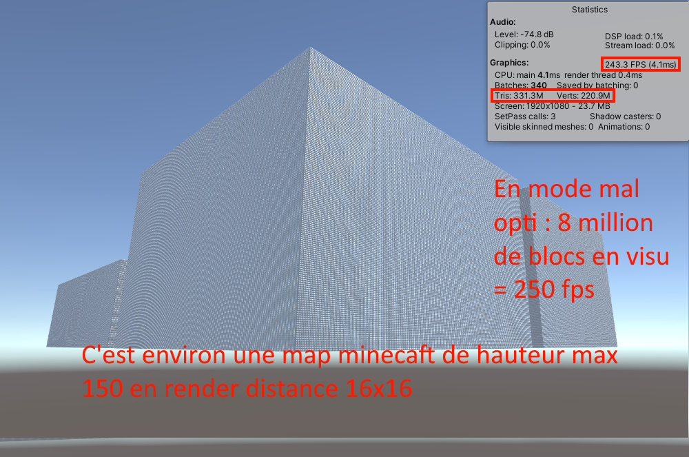
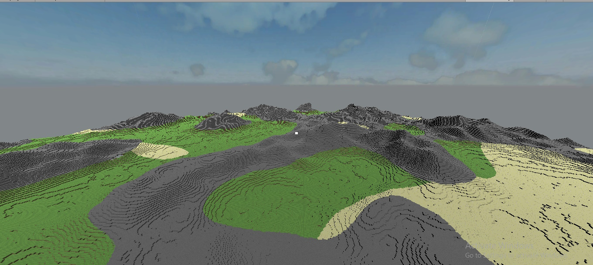
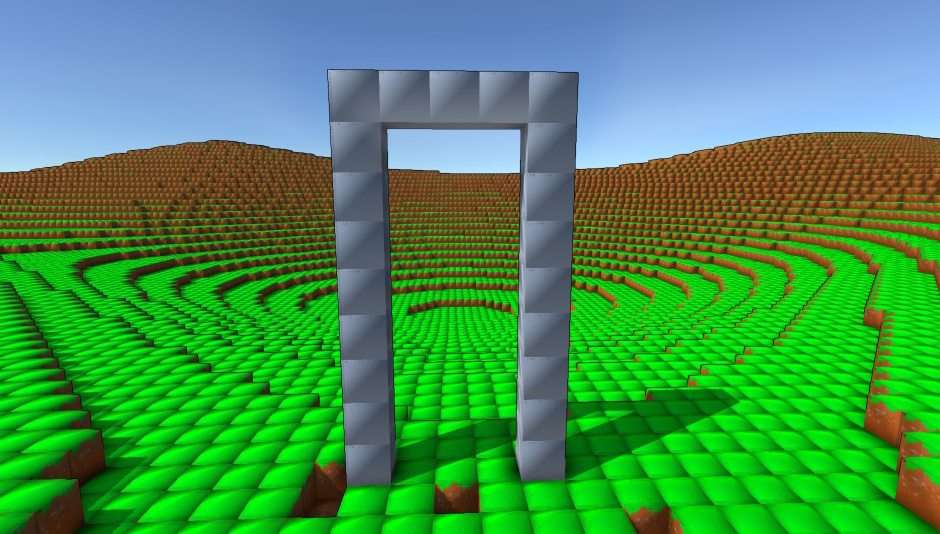
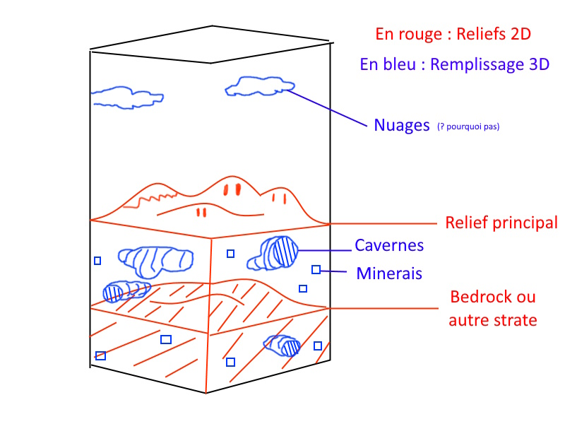
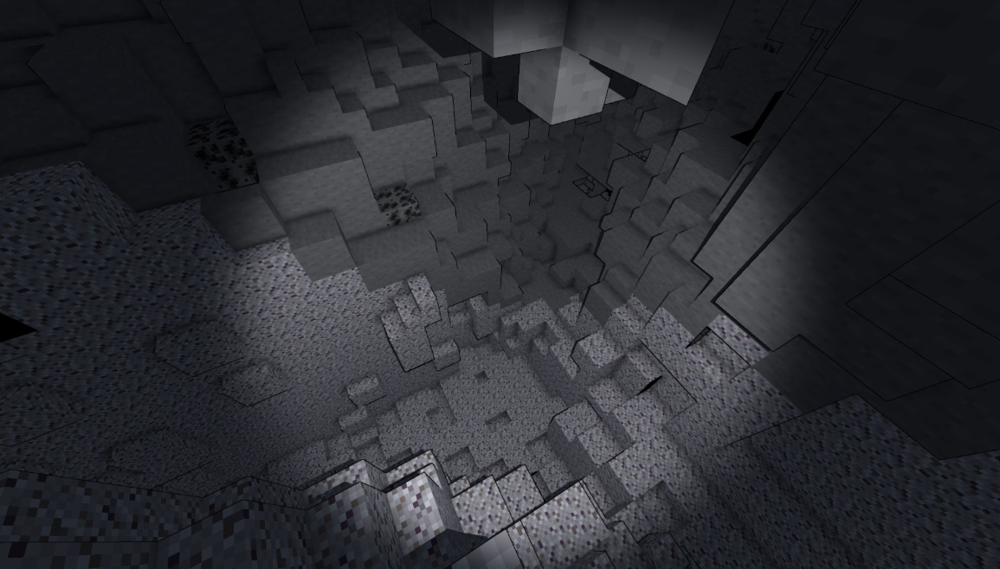
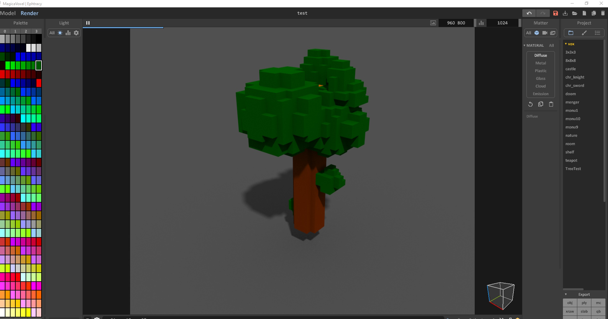
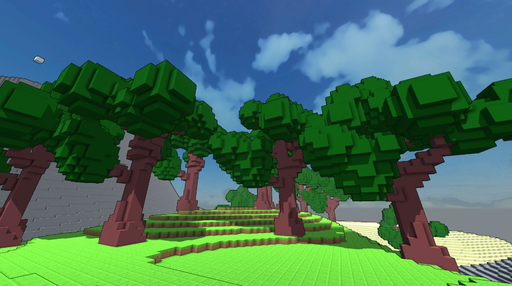

<title></title>

## Description

Jeu fortement inspiré de `Minecraft` avec une fréquence de bloc 2x fois plus élevée, une render-distance 2x plus élevée aussi, de nouvelles fonctionnalités telles que l'import de mods, de scripts en lua, de nouveaux models 3D...

<autotab></autotab>

 

## Développement

Beaucoup de contraintes techniques dans ce projet. Par exemple, pour la génération et l'affichage d'un grand nombre de cubes. Pour générer des chunks de (32 * 32 * 128) blocs, dans un champ de vision simplifié à 16x16 chunks, on obtient 33.54 million de cubes à afficher.
Il y a eu beaucoup de veille et de travail sur les meshs, les matérieux et des Uvs pendant la premiere phase de développement.

<imagegroup></imagegroup>

*premières ébauches du développement des meshs*

  Une fois l'affichage de gigantesques meshs multi-matériaux appréhendé, j'ai pu commencer les premiers prototypes de terrains. La génération était faite avec des noises (cellular noise pour les biomes). Un gros problème aura été de trouver une manière de connecter les biomes entre eux, de manière "smooth", résolu par un système de noises "températures" décrivant les pourcentages d'appaitions des biomes. 

<imagegroup></imagegroup>

*premières ébauches des terrains*

<imagegroup></imagegroup>

*Test de génération de cavernes*

J'ai ensuite travaillé avec deux autres développeurs. L'un se chargeait d'implémenter un système de mods, avec chargement de ressources et scripts lua. L'autre travaillait sur une généation de terrain plus réaliste et plus complête. Pendant ce temps je travaillais sur l'interface de l'inventaire et l'importation de structures depuis `MagicaVoxel`, un logiciel de création de models 3D en voxel.

<imagegroup></imagegroup>

*A gauche, un arbre visualisé dans l'editeur `MagicaVoxel`, à droite : des arbres importés dynamiquement dans le projet*

Le prototype est jouable. Voici quelques fonctionnalités notables :

- Plusieurs joueurs peuvent se connecter en réseau sur la même map via *Photon*. 
- Les fonctionnalités d'inventaire, de gestion des objets ainsi que leur tenue en main.
- Système de pioche et de destruction du terrain.
- Systèmes de génération de cavernes par biomes.

 

*Axe d'amélioration*
Pas assez de veille sur les manières des gérer des milliards d'objets dans UNITY, l'utilisation d'un compute shader aurait clairement été une meilleure solution que d'utiliser le CPU pour generer les meshes.

<history>
*[Infos en vrac]*

Par rapport au schéma sur les 3 cubes, j'ai choisi l'option 2, qui permet
- De ne pas générer les faces inutilisées
- D'afficher une partie de la texture différente sur chaque face (4 uvs différents/face)

Avec le développement de ce jeu, j'ai pu découvrir combien la génération procédurale m'intéresse et me motive !
En effet, la découverte des noise avec l'application de fonction mathématiques complexes des bruits par exemple, était extrêmement intéressante.

En bon développeur dans le domaine de l'informatique et du jeu vidéo, j'avais joué à de nombreux jeux dont `Minecraft`. Bien qu'un classique de l'industrie entière, de nombreux éléments me dérangeaient comme son esthétique, son manque d'optimisation qui ammenait à des lagues réguliers, et comme des fonctionnalités manquantes ou pas suffisamment poussées. Unity en tant que moteur semblait posséder les ressources nécessaires à le faire tourner même avec les ajouts ou modifications que j'envisageai, puisque `Minecraft` reste un monde composé d'une succession de cubes.

Mon objectif était le suivant : faire un rework du jeu en augmentant fortement la précision, c'est à dire qu'on pourrait désormais casser des centimètres de terrain. L'approche serait alors plus réaliste, comme par exemple la capacité de creuser un trou 20 blocs par 20 blocs.
Cela donnerait des millions de blocs à mettre en mémoire et stocker, ainsi qu'à afficher de manière procédurale.

Les premières questions qui ont dues être posées sont qu'est ce qui définit un cube ? Un chunk ? La différence entre les deux, effectuer une sorte de veille sur les fonctionnalités de base, chercher les méthodes qui permettraient un maximum de simplification (multithreading), etc. Il était nécessaire que tout s'approche le plus possible du parfait, car un problème sur un bloc, c'est les millions d'autres qui sont impactés (quelle optimisation, la meilleure possible, stocker entier ou short ?, utilisation de pointeur, etc).

Il s'est avéré que des blocs deux fois plus petits que leur taille originelle
accessible en faisant des blocs deux fois plus petits que minecraft - rendu et génération de blocs de 50cm au lieu de 1m, ça ne laguati pas sur des orids ok

Début, placer des bocs dans un environnement (gérer meshs et vertex, et mélange de plusieurs modèles 3D bien chiant)

Intérêt à la génération -> mec de DUT1 se sont intéressés au projet, idées donnée, LUA, style VOXEL (pixel en 3 `voxalidit`)

Jeu doit être compatible avec ce genre de modèle 3D pour que les futurs joueurs puissent importer leur fichier de config sans problème => Système d'exportation fonctionnel (exemple arbres)

arrêt du projet après inventaire, gestion des objets, système de pioche

génération avec des noises pour placer des minerais de manière pas entièrement aléatoire

gros problèmes d'optimisation même avec les études de complexité faites au préalable

Fonctionne en multi - semblant, même map

autres mecs commentaient par leurs avancées, moteur pour charger LUA par exemple il s'est arrêté en plein milieu du coup bug quasi impossible à corriger, même si élément fonctionnel

Prototype jouable, arrivée sur la map, génération infinie, 5 biomes différents, multi ok tier.

A tout moment du projet, très optimiste et heureux du résultat - toutes les fonctionnalités et logiques étaient compliquées, donc chaque élément compris était comme un mini projet réussi donc valorisation et retour positif immédiats.

</history>

<nextprojects></nextprojects>
