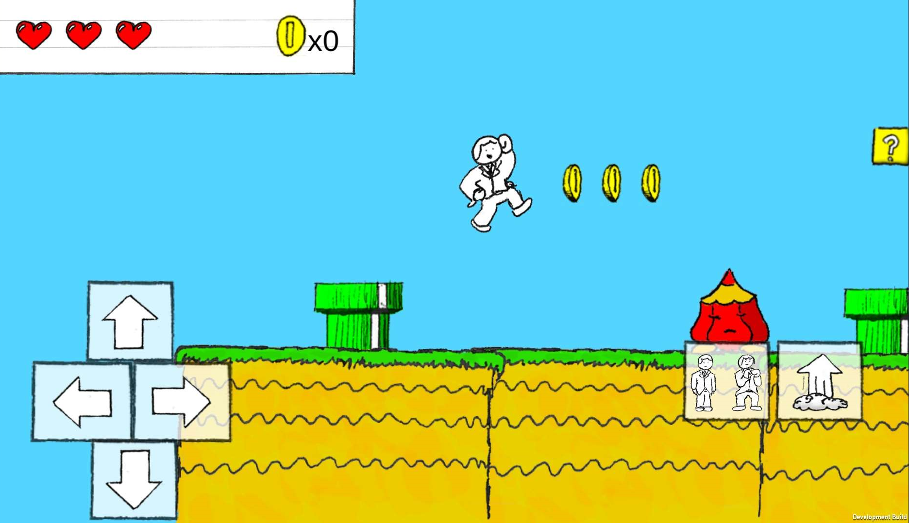
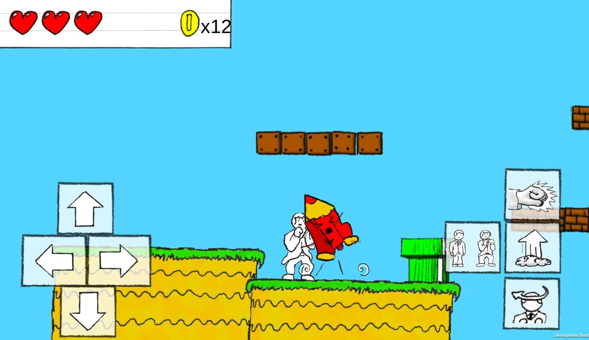

<title></title>
<autotab></autotab>

## Description

Petit jeu de plateforme sur mobile.

## Développement

Le jeu a été imaginé et dessiné entièrement en cours de terminale de philosophie, sur de minuscules bouts de papiers. Mes pages d'agenda étaient remplis de chacune des frames d'animation du personnage (Mr Kata), des ennemis et de tous les autres éléments visuels présents dans le jeu (pièce, briques, tuyau, etc.). Chaque image a ensuite été scannée, et intégrée au jeu.

On peut se déplacer, s'accroupir, sauter, se battre en donnant des coup de points et en faisant des pas chassés, ramasser des pieces, casser des blocs... C'est tout. C'est un prototype !

J'aime beaucoup ce prototype car il met en avant un univers très personnel auxquel je tiens beaucoup.

<nextprojects></nextprojects>