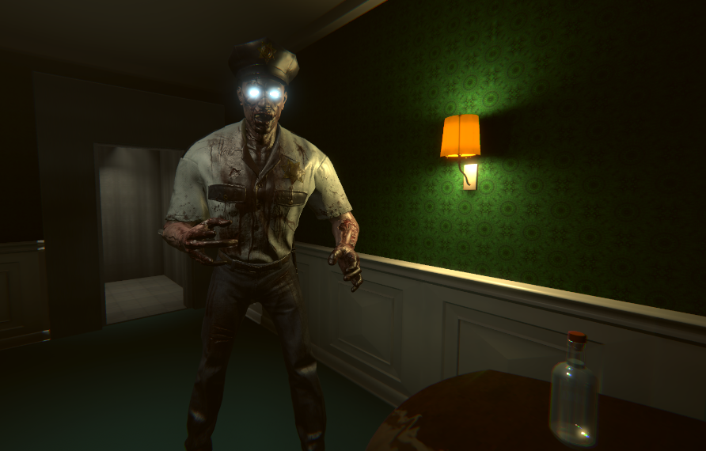
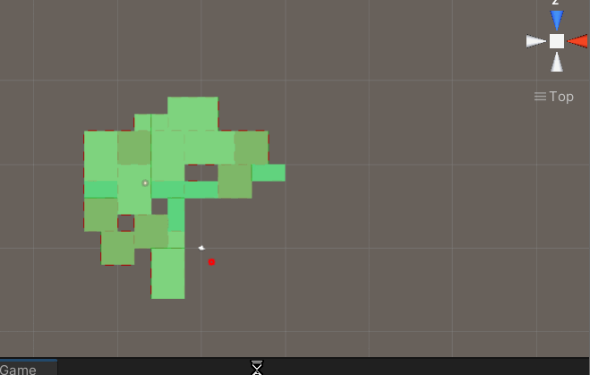
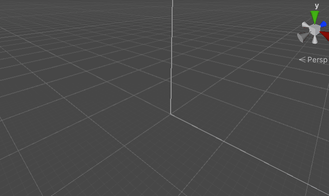
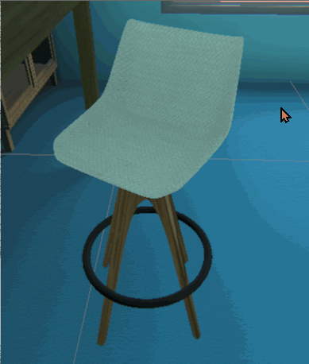
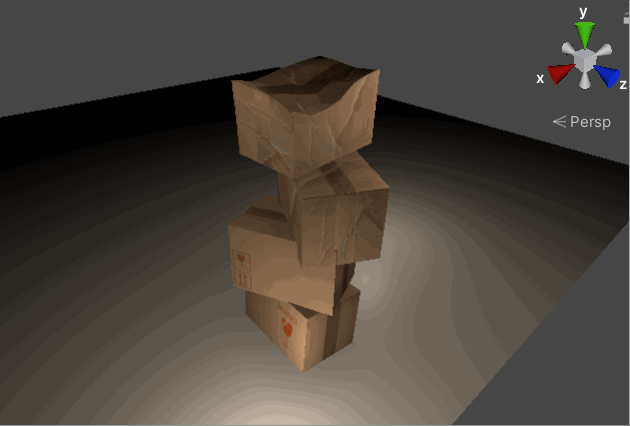
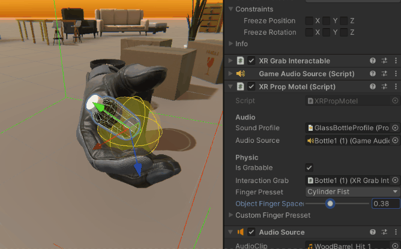
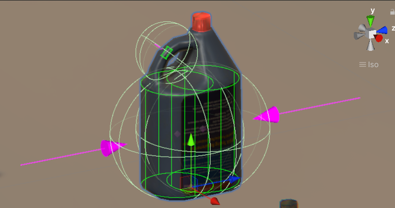
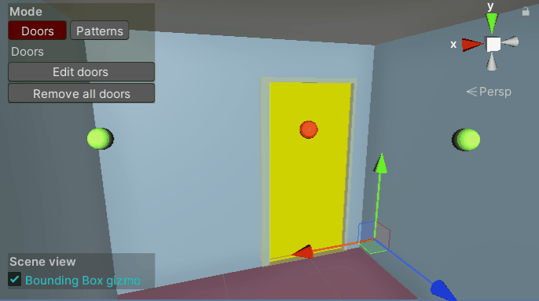
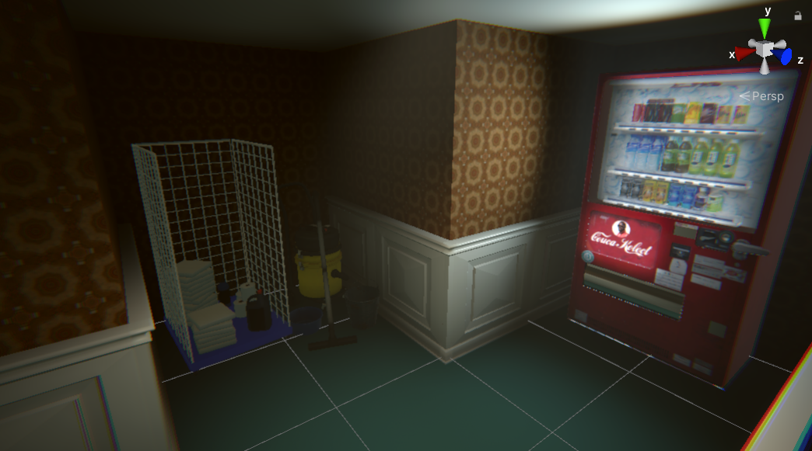

<title></title>
<iframe width="896" height="504" src="https://www.youtube.com/embed/sOHHD-aJkuQ?si=xSddC2NbXiyy4RhD&hd=1" title="YouTube video player" frameborder="0" allow="accelerometer; autoplay; clipboard-write; encrypted-media; gyroscope; picture-in-picture; web-share" referrerpolicy="strict-origin-when-cross-origin" allowfullscreen></iframe>

## Description

Room 505 est un jeu d'exploration et d'horreur multijoueur en VR. Les joueurs doivent s'échapper d'un hotel, en cherchant des objets et des indices dans les chambres.

<autotab></autotab>

## Contexte

Projet en équipe de 6. Développé en tant que projet de fin d'année de notre 4ème année d'études supérieures à l'ESIEE paris.

## Développement

- Génération procédurale de la map
- Veille : choix de la render pipeline, méthodes d'obtention/création d'assets 3D
- Réalisation d'un protocole au sein de l'équipe pour gérer l'ajout de nouveaux éléments 
- Développememnt d'outils dans UNITY pour créer des salles, simplifier la création de props attrapables, créer des dialogues...
- Travail sur la sensation d'immersion VR :
   - Placement des doigts et des mains réalistes autour des objets saisis
   - Bruit lorsque des objets s'entrechoquent, sont secoués.

<imagegroup></imagegroup>

*Placement procédural de salles*

<imagegroup></imagegroup>

*Props implémentés dans le jeu*

<imagegroup></imagegroup>

*La saisie des éléments dans le jeu*

<imagegroup></imagegroup>

<video width="640" height="360" controls>
  <source src="/Jub_Biography/Projects/Unity/Room505/./medias/portal.mp4" type="video/mp4">
</video>

<nextprojects></nextprojects>