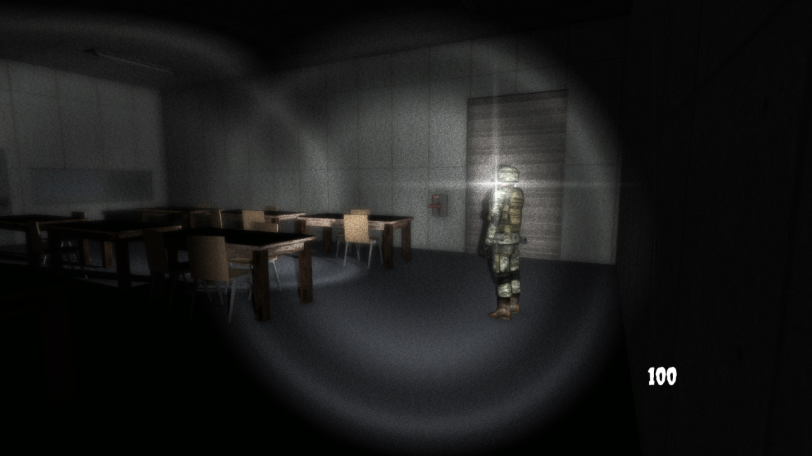
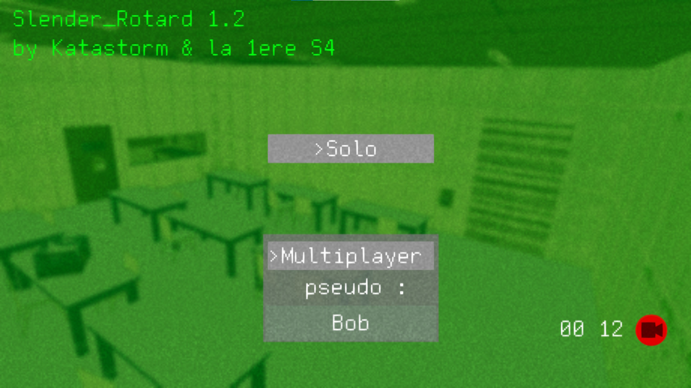
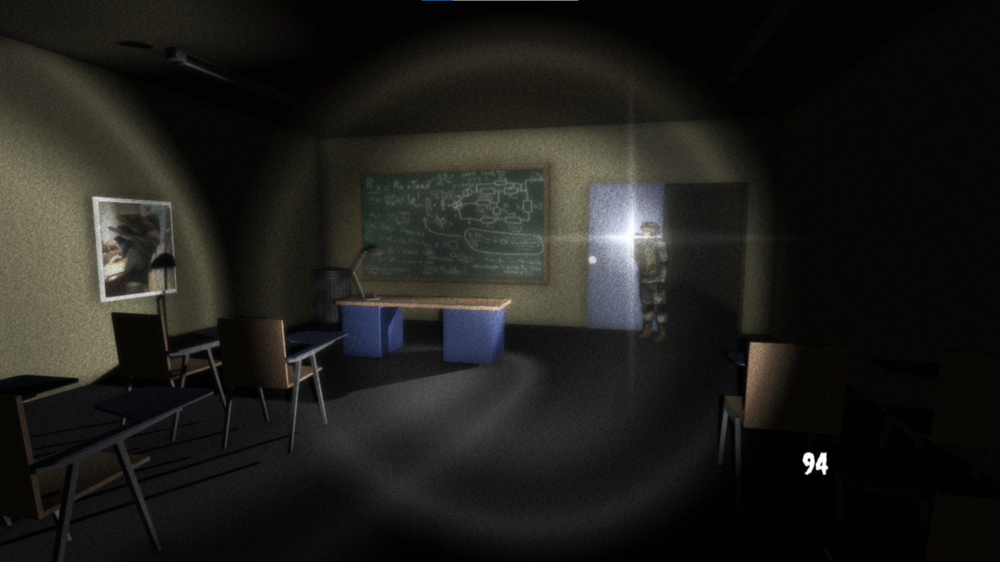

<autotab> <table><thead><tr><th>Date de création</th><th>Finalisation</th><th>Ampleur du projet</th><th>Wow effect</th><th>Type de projet </th><th>En Ligne</th></tr></thead><tbody><tr>
        <td>octobre 2016</td>
        <td>février 2017</td>
        <td>medium</td><td>epic</td>
        <td>Jeu complet</td><td>NO</td>
        </tr></tbody></table></autotab>

## Description

Jeu d'horreur multijoueur type Slender. Série d'action à réasliser pour s'enfuir d'un batîment sans mourir.

## Contexte

En 2016, un peu lassé par le développement de [Chicken Shock](/Jub_Biography/projects/Unity/ChickenShock_GigaOmelette), je décide de faire une pause. Ca faisait un bout de temps que je n'avais pas fait de 3D sur Unity. Vu que *Chicken* faisait fureur dans ma classe de pemière, je me suis dit qu'un jeu en multi serait bien reçu aussi. 

## Développement

Le but du projet était de créer un Slender, où le Slenderman était un de nos professeur de SI (science de l'ingénieur). L'intégralité du développement a du durer quelques mois. Les élèments du décord ont été fait sur *Google Sketchup*. La lib réseau est encore et toujours `Photon Pun`. 

## Produit final

Le jeu est terminé, et marche extrémement bien ! Il y a quasi 0 retour de bugs. L'immersion est parfaite et la jouabilité est trés bonne. Il y a environ 20-30 minutes de gameplay facilement.

<nextprojects>

> Projet précédent -  [Chicken Shock Giga Omelette](/Jub_Biography/projects/Unity/ChickenShock_GigaOmelette)

> Projet suivant -  [Space crossout](/Jub_Biography/projects/Unity/SpaceCrossout)

</nextprojects>