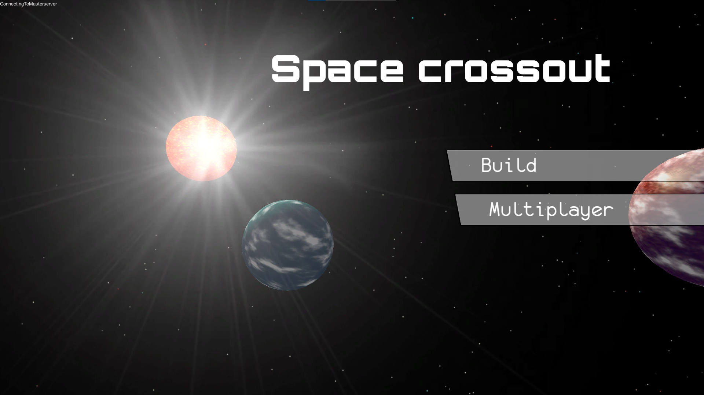
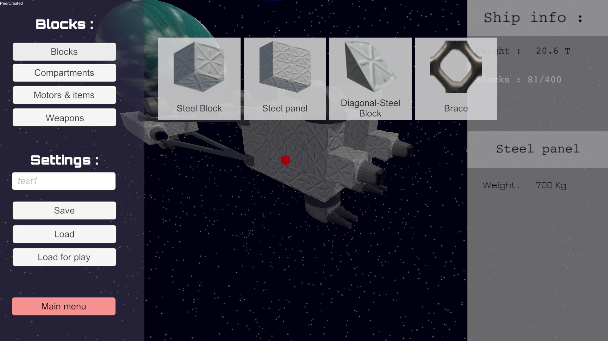

<autotab> <table><thead><tr><th>Date de création</th><th>Finalisation</th><th>Ampleur du projet</th><th>Wow effect</th><th>Type de projet </th><th>En Ligne</th></tr></thead><tbody><tr>
        <td>janvier 2017</td>
        <td>mai 2017</td>
        <td>medium</td><td>very cool</td>
        <td>Prototype jouable</td><td>NO</td>
        </tr></tbody></table></autotab>

## Description

Jeu de création de vaisseaux et d'exploration spatiale.

<video width="720" height="480" controls>
  <source src="/Jub_Biography/Projects/Unity/SpaceCrossout/./medias/example.mp4" type="video/mp4">
</video>

## Contexte

J'étais très inspiré par le jeu `Crossout`, où le but est de créer des vehicules et d'affronter d'autres joueurs. Je commençais a avoir des bases solides sur Unity. Cependant l'idée du projet était de pouvoir créer des vaisseaux spatiaux. Le moteur physique d'Unity étant vraiment fourni, ca a réduit le travail à juste développer un éditeur de vaisseaux. Après le RPG 3D, j'avais commencé à m'interesser à `FL-Studio`. Ce jeu a donc aussi été l'occasion de composer ma première musique de jeu.

## Développement

Utilisation de *Blender* pour la première fois dans le but de faire des textures, des éléments pour les vaisseaux, des briques de constructions etc.
L'interface de l'époque, avant la version 2.8 de *Blender* était absolument horrible et la courbe de progression était difficile. Beaucoups de fonctionnalités ont étés implémentés pour pouvoir construire ses vaisseaux : des propulseurs avec inputs clavier personalisés, des tourelles qui peuvent tirer à l'endroit ou l'on clic... 

Un prototype de génération de terrain à aussi était mis en place. Un des buts du projet était que l'ont puisse atterrir sur des planetes, même si cette fonctionalité n'a jamais été implémentée. Les terrains de tests étaient générés de manière procédurale. C'était ma première génération de terrain, je ne connaissait pas les noises. J'ai donc utilisés des fonctions mathématiques chaotiques et des cossinus pour faire des colines.

## Produit final

Le produit final se joue moyennement en multi car la gestion de la physique devenait très compliquée à partager au travers du réseau (Où placer quel élément du vaisseau à quel moment, sachant que tout était mobile).

Cependant il est possible de créer son propre vaisseau en le construisant élément par élément, pour ensuite partir en exploration dans l'espace !

## Ressenti

Je ressens beaucoup de fierté envers ce projet et son déroulement, c'était instructif de bout en bout.

<nextprojects>

> Projet précédent -  [Slender Letard](/Jub_Biography/projects/Unity/SlenderRetard)

> Projet suivant -  [PaperKata platformer](/Jub_Biography/projects/Unity/PaperKata)

</nextprojects>
