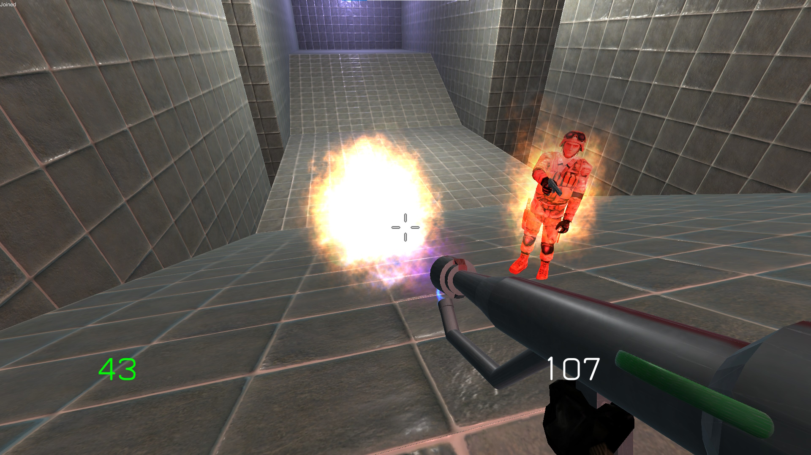
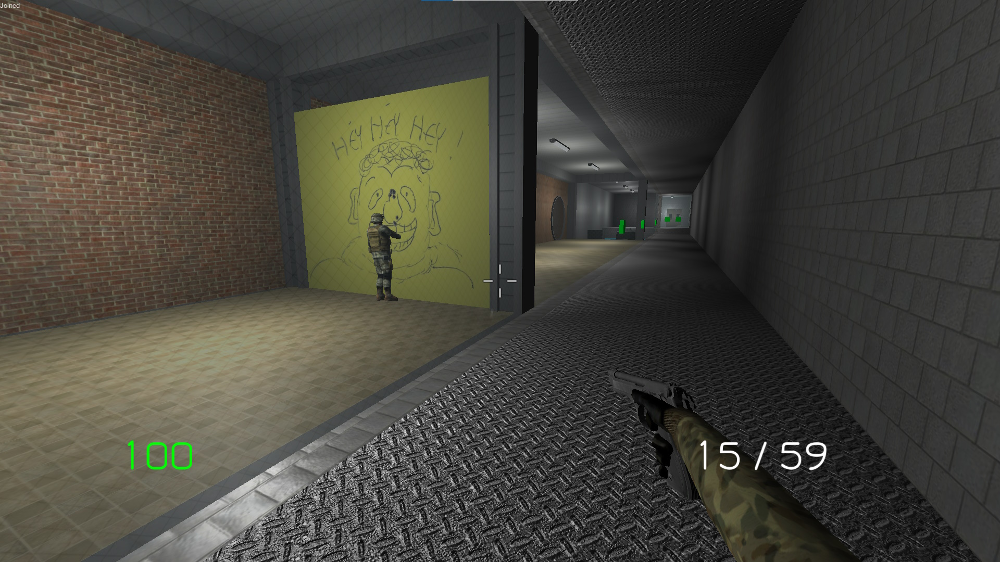
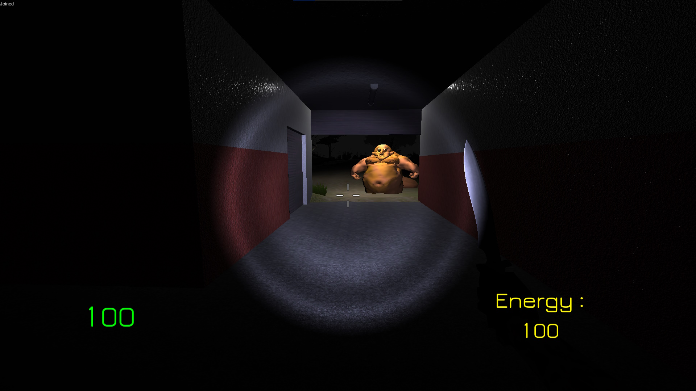

<autotab> <table><thead><tr><th>Date de création</th><th>Finalisation</th><th>Ampleur du projet</th><th>Wow effect</th><th>Type de projet </th><th>En Ligne</th></tr></thead><tbody><tr>
        <td>mars 2016</td>
        <td>mai 2016</td>
        <td>medium</td><td>cool</td>
        <td>Jeu alpha / incomplet</td><td>NO</td>
        </tr></tbody></table></autotab>

## Description

Dans l'idée, ce jeu est un remake de [Steel Bulletfury](/Jub_Biography/projects/Unity/SteelBulletFury). Un FPS multijoueur avec un mode "horreur" où quelqu'un incarne un monstre et doit chasser les humains.

## Contexte

L'objectif était de toujours s'approcher de la permissivité de `Cube 2 Sauerbraten`, notement dans la création de niveaux par les utilisateurs. J'avais un petit plus de connaissances techniques et trouvais que `Steel Bulletfury` était affreusement optimisé, sans compter les nombreux bugs. J'ai donc décidé d'appliquer ces nouvelles connaissances en repartant de zéro.

## Développement

La lib réseau est toujours `Photon Pun`, à mon habitude. J'ai développé un système de matchmaking, qui permet de choisir entre les différentes rooms (session de jeu en ligne), avec des paramètres. Ca fonctionnait vraiment bien ! Les armes (couteau, lance-flamme, pistolet) ont chacun leur propre animation d'attaque et d'utilisation, visible en vue à la première personne comme à la troisième personne ennemi. Une caméra spectateur a été ajoutée, qui permet au joueur d'observer le reste des combats après leur mort.

Plusieurs modes de jeu ont été implémentés pour le coté FPS. On a nottement une map Deathrun (comme sur `gari's mod` ou `Team fortress 2`), mettant en scene un parcour d'ostacles avec 1 joueur qui déclenche des pièges. Extremement fun.

## Produit final

Le jeu fonctionne correctement. Le deathrun, est truffé de références personnelles, de ma vie de fin de collège / début lycée : les pièges ont été inspirés par la map *dr_aconian* de `Team fortress 2`, une map extrêmement drôle qui tournait sur un serveur. On a beaucoup joué sur ce projet avec les potes, des fois à faire des parties à 10 joueurs simultanées.

Le mode Slender offrait une experience différente, avec une autre map, différents objectifs et un nouveau slender pilotable par un joueur. Le slender peut pousser des cris pour faire peur aux autres joueurs

## Ressenti

Mon objectif principal dans le jeu était que l'ont puisse voir ce que tiens le joueur d'en face dans ses mains. Ca peut paraître bête mais c'était pas si évident à l'époque. Avoir un Player Controller qui fonctionnait aussi bien n'était pas non plus facile.

Je reste plutôt déçu du résultat, puisque j'ai passé le plus clair de mon temps à développer la fonctionnalité de Deathrun dont le résultat me satisfaisait pleinement. Je n'ai donc pas passé de temps significatifs sur la correction de bug, faire de la veille et regarder des tutos... Trop occupé à implémenter idée après idée de pièges et de références persos à mon groupe de potes ! Il y a aussi un mode d'édition de niveaux qui à vu le jour, mais la feature n'est pas trés élaborée et ne fonctionne pas en tant que tel.

Ainsi bien que je sois resté sur ma faim à l'encontre de mes objectifs initiaux. J'ai vraiment apprécié les nouveau éléments gameplay et le jeu en lui même qui est encore très jouable et amusant à ce jour !

<nextprojects>

> Projet précédent -  [RPG 3D](/Jub_Biography/projects/Unity/RPG3D)

> Projet suivant -  [Demo nuclear](/Jub_Biography/projects/Unity/DemoNuclear)

</nextprojects>