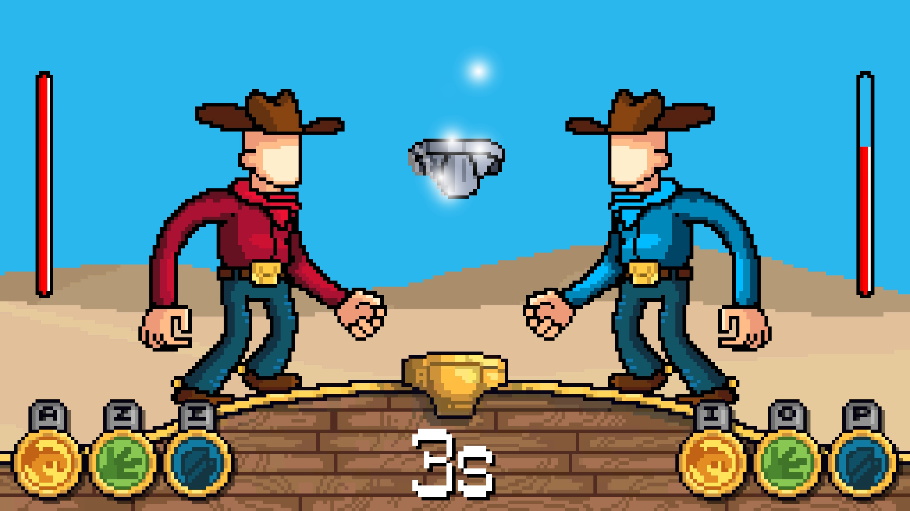

<title></title>

## Description

Underwar est un jeu type pierre-feuille-ciseaux, disponible sur [itch.io](https://LOGIKED.itch.io/underwar). Développé en collaboration avec un graphiste.

<autotab></autotab>

Underwar peut se jouer sur le même ordinateur en utilisant des parties du clavier différentes, ou en réseau en se rejoignant à distance sur une room commune. Une version Android est également disponible.

<nextprojects></nextprojects>
