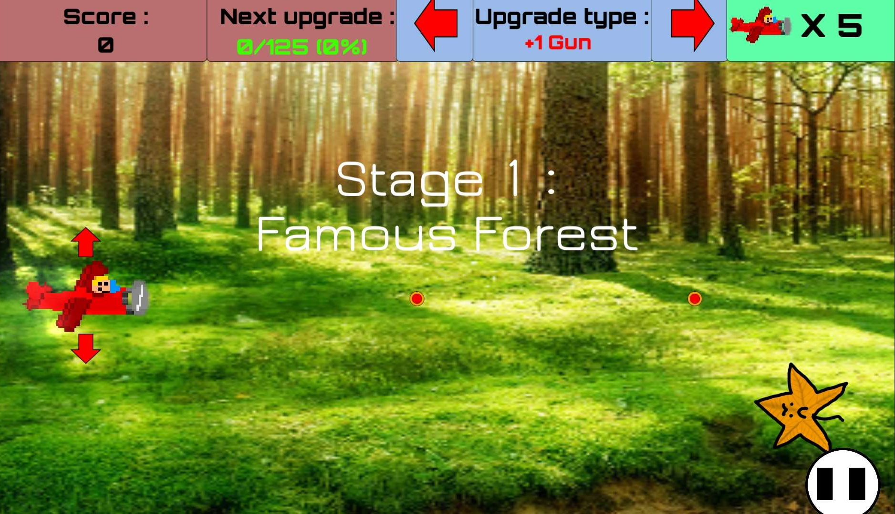
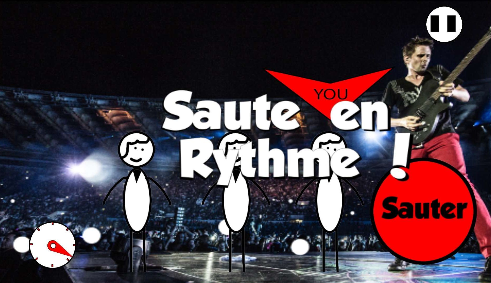
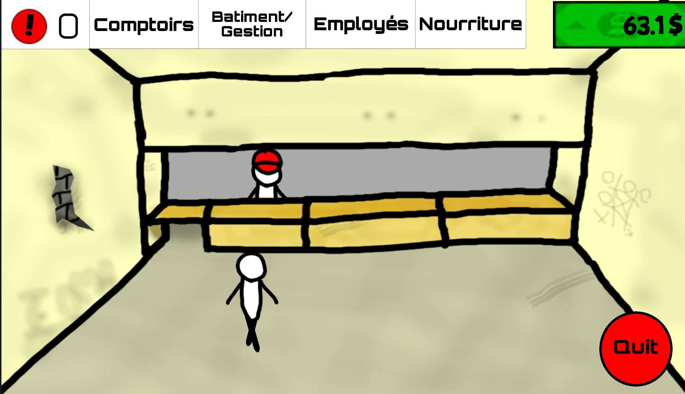

<autotab> <table><thead><tr><th>Date de création</th><th>Ampleur du projet</th><th>Wow effect</th><th>Type de projet </th><th>En Ligne</th></tr></thead><tbody><tr><td>décembre 2015</td><td>medium</td><td>very cool</td><td>Jeu alpha / incomplet</td><td>NO</td></tr></tbody></table></autotab>

## Description

Jeu mobile permettant d'accéder à 3 modes de jeux :
- Jeu de type `Space invaders`, où on dirige un avion qui doit survivre aux ennemis arrivant par le scrolling de l'écran,
- Série de mini-jeux sur qui s'enchaînent de plus en plus rapidement,
- Jeu simple de gestion de restaurant.

## Contexte

Une forte envie de créer un jeu similaire à `Warioware` originairement apparu sur GameBoy, dont l'ambiance, le dynamisme et l'ingéniosité des mini-jeux m'avait marqué. C'est d'ailleurs une musique d'un `Warioware` ce jeu qui a été utilisé dans le mien.

Mr.Kata provient d'un personnage que j'ai inventé quand j'avais 10, dans une bande dessinée. Personnage qui me suivra dans mes créations par la suite.

Quand j'ai lancé ce projet, je souhaitais tester pour la création d'une application mobile, n'ayant jusqu'alors que travaillé sur des jeux PC.

## Développement

J'ai du me plonger dans le monde des installation d'Android SDK, de JRE, de JDK, blabla... Sacré rigolade.

Le développement a commencé par les mini-jeux, qui finiront au nombre de quinze jeux d'une durée chacun d'environ 4 secondes. Ca paraît court, mais promis, c'est super fun !

Aprés ça, j'ai cherché de nouvelles dynamiques à implémenter.

Le "Shoot them up" arriva, choisi par sa facilité et son aisance de développement (de base c'était un mini-jeu de 4 secondes, et j'en ai fait un élèment à part). J'ai créer plein d'ennemis bizarres, situations loufoques, boss aux pattern intéressant, etc. On doit avoir une dizaine de minutes de jeux, si le joueur arrive a ne pas mourrir (peu probable).

La dernière étape fût un essai à un jeu de gestion, un restaurant dont il faut gêrer employés, clients, stocks et matériel. Jamais abouti.

## Produit final

Des mini-jeux très droles, parfaitement addaptés à la plate-forme.

Pour le ShootThemUp : Une ambiance amusante par la présence d'images trouvées sur le net en background, avec un enchaînement fluide et agréable des niveaux.

Le jeu de gestion ne sera jamais abouti, malgré la création d'un ensemble de petits paramètres qui étaient à gérer précausieusement.
Il existait même la présence d'éléments de gameplay pouvant déclencher des évènements de géopolitiques (genre restaurant tellement sale qu'une pandémie mondiale commence, etc).

## Ressenti

Je n'avais pas eu de difficultés particulières, il avait été plaisant à développer.
Mes tests se transformaient régulièrement en longs moments de jeux, sur plusieurs de mes téléphones, ce qui faisait transparaître une utilisation agréable et un jeu réussi. Jamais mis en ligne, mais distribué à beaucoup de personnes, qui, pour certaines, y jouent encore de temps à autre.

<nextprojects>

> Projet précédent -  [Steel bullet fury](/Jub_Biography/#projects/#SteelBulletFury)

> Projet suivant -  [RPG 3D](/Jub_Biography/#projects/#RPG3D)

</nextprojects>
