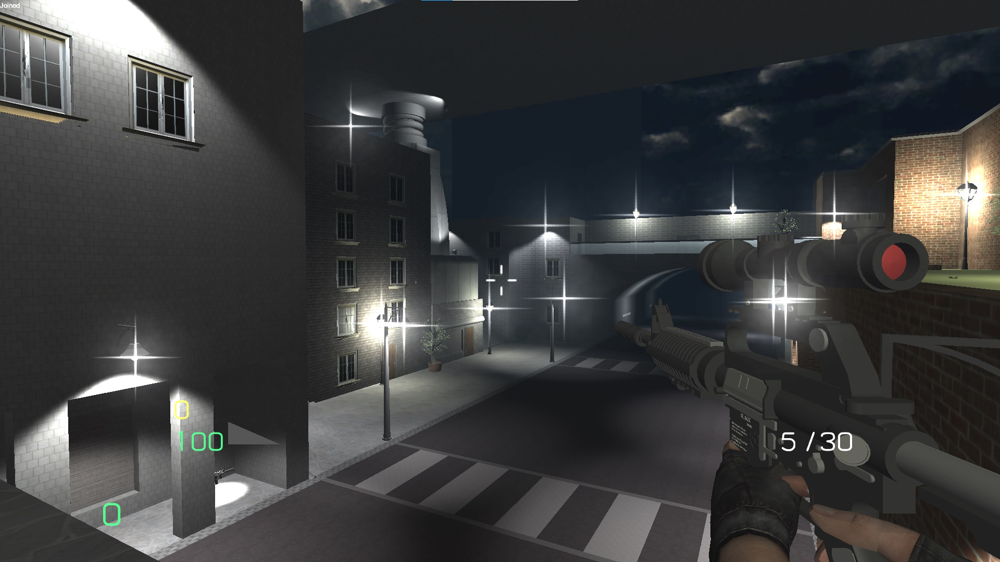
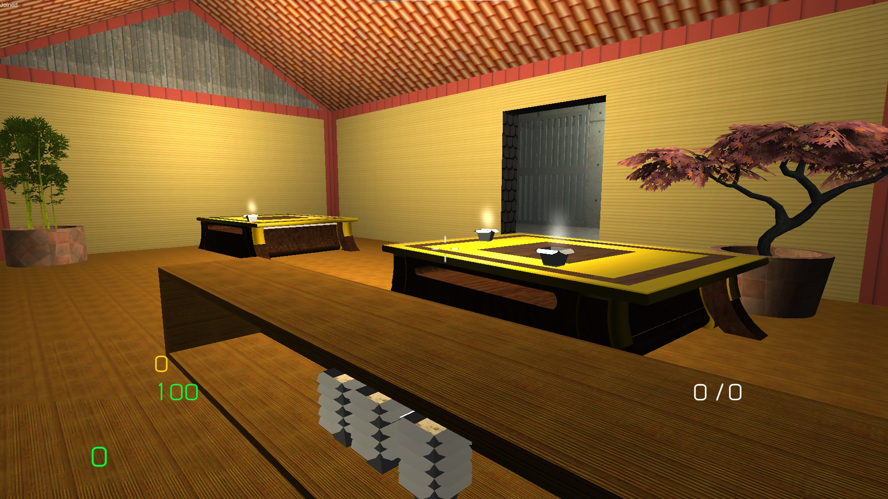

<autotab> <table><thead><tr><th>Date de création</th><th>Ampleur du projet</th><th>Wow effect</th><th>Type de projet </th><th>En Ligne</th></tr></thead><tbody><tr><td>mai 2015</td><td>large</td><td>cool</td><td>Jeu complet</td><td>NO</td></tr></tbody></table></autotab>

## Description

Jeu de tir multijoueur, avec un mode de jeu "Horreur".

## Contexte

`Steel BulletFury` est né à partir d'une envie d'imiter les jeux `Cube 2: Sauerbaten` et `Unreal tournament`. L'idée de pouvoir construire mes propres maps et mes propres mécaniques de jeu me plaisait bien.

L'ajout de la partie *Slender Shrek* vient de mon intérêt pour les jeux d'horreur. J'ai toujours aprécié les jeux d'horreur multijoueur. J'étais souvent sur `Garry's mode` ou `Team fortress`, sur des serveurs de jeu horreur. Je voulais essayer de creer une experience similaire.

## Développement

Le dev est en C#, que je découvrais à l'époque. J'ai commencé par suivre des tutoriels sur *Photon Network* et qui est désormais *Photon Pun* de **Photon Engine**, plugin leader du développement multijoueur sur Unity. Assez rapidement j'ai pu créer une scene, et connecter plusieurs joueurs dessus.

Le mode de jeu `slender-shreek` est issu de l'ancien projet [Slender1]("/Jub_Biography/#projects/#Slender1). Il a suffit d'un rework général pour être implémentable en multijoueur. L'ajout de quelques props, models 3D, sons ainsi que d'une nouvelle map aura suffit à faire quelque chose de grandiose.

## Produit final

Depuis le menu principal, le joueur peut choisir entre 3 modes de jeux, 4 maps complexes différentes, des skins et la possibilité de jouer en multi. Que demande le peuple ? J'avais 14 ans et c'est qu'est-ce qu'on s'est marré sur ce jeu.

<video width="896" height="504" controls>
  <source src="/Jub_Biography/Projects/SteelBulletFury/./medias/dance1.mp4" type="video/mp4">
</video>

## Ressenti

Le développement m'a beaucoup amusé, et pouvoir tester le jeu avec mes amis et avoir leur retour en direct, c'était motivant. J'étais conscient qu'il restait une certain nombre de bugs, mais le potentiel de divertissement était tel que je ne voyais pas le besoin d'atteindre la perfection.

## Mode Histoire

<history>

*[Infos en vrac]*

Anectote : les jeux multijoueurs sont bloqués par la plupars des pare-feu des écoles. Ca nous à bien embétés au collège et au lycée.  

à partir début dev du jeu, cube 2 sauebrateun voir au dessus.

Trouvé tuto sur multijoueur, solution photon Engine. Tatonnement + essais multiples = avoir plusieurs personnes dans le même jeu. Intérêt avec avoir 

add on clé en main qui permettait rapidement de faire du multi

Premier = la map sur google sketchup. Au début pas de menu, juste la map.

Création du menu, death match, nombre de mort pour gagner la partie.

Dès que tout le système fonctionnait bien, décision d'intégrer le slender - refonte du script pour permettre de fonctionnement multi, bcp d'essais avec des amis jusqu'au ras le bol. Découverte que photon bloqué par bcp de pare-feux, difficile de faire le beau devant les copains. 

unreal tournament 2003 - fps shooter, habitude de faire des LANs => Donne l'idée d'en faire sur mes jeux, version 15 était version haloween, inviter groupe de potes. Multiplication du nombre de map - 3 modes de jeux et 4 maps, montagnes, ville, intérieur, halloween. skins + mode john cenna invoquable, dernière fonctionnalités en cours de dev mais jamais terminée = spray de peinture sur les murs.

Dev en essayant de faire moins d'erreurs, plsu de déboggage. au fur et à mesure du dev, dev du regard critique rétrospectif, vision des bugs

insert vidéo de démo

Avant la fin, ajout de slender shreck - collecte de papiers avant de se faire attraper par le shrek se baladant autour de nous.

Slender quand tu regardes il te poursuit

Map sur google sketchup: ville (inspi importante enfance warseaw) + marais + hiver (inspi : unreal tounament 3) + intéreur.

</history>

<nextprojects>

> Projet précédent -  [RPG 2D](/Jub_Biography/#projects/#RPG2D)

> Projet suivant -  [Kata's minigames](/Jub_Biography/#projects/#MrKataMinigames)

</nextprojects>
