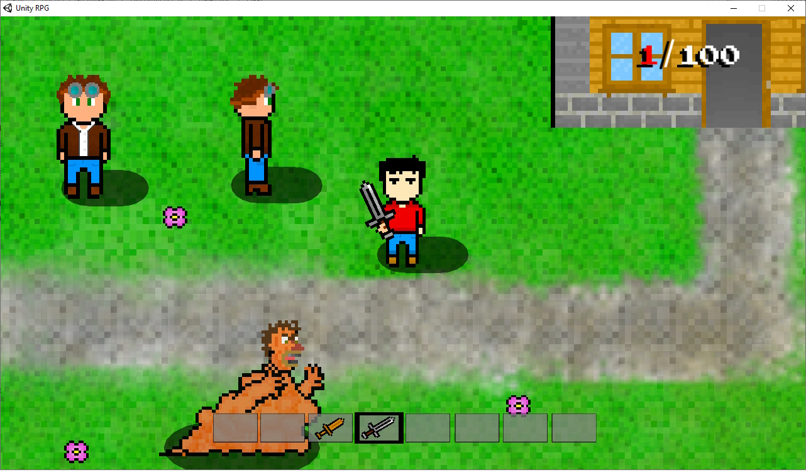
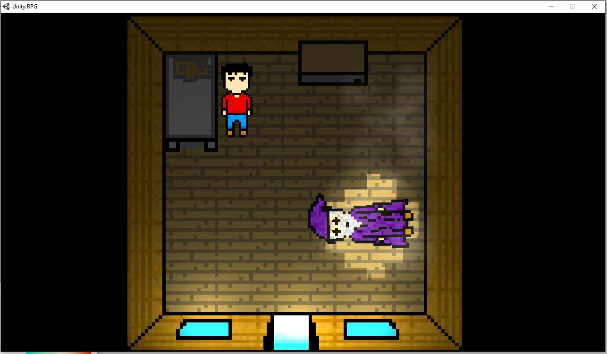

<autotab> <table><thead><tr><th>Date de création</th><th>Finalisation</th><th>Ampleur du projet</th><th>Wow effect</th><th>Type de projet </th><th>En Ligne</th></tr></thead><tbody><tr>
        <td>mars 2015</td>
        <td>septembre 2015</td>
        <td>small</td><td>null</td>
        <td>Prototype court</td><td>NO</td>
        </tr></tbody></table></autotab>

## Description

RPG 2D en vue du dessus avec un design collaboratif.

Ce jeu a été développé dans la période fin collège début lycée, et s'inspirait des vieux Zelda.

Il existait un système de dialogue rudimentaire, un Player Controller, un inventaire et des interactions classiques entre joueur et PNJ.

Tous les sprites devaient être des dessins / animations de mes amis, afin d'obtenir un jeu étant le fruit du travail et de l'expression artistique de chacun. Le résultat est proche de ce que je m'étais imaginé, malgré un arrêt du développement relativement tôt. Le nombre de projet que je développais en parallèle m'obligeait à partager ma concentration et ma motivation entre tous.

Je reste fier des cinématiques créatives du début, ainsi que des fonctionnalités implémentées.

<nextprojects>

> Projet précédent -  [Goblinville FPS](/Jub_Biography/projects/Unity/Goblinville)

> Projet suivant -  [Steel bullet fury](/Jub_Biography/projects/Unity/SteelBulletFury)

</nextprojects>