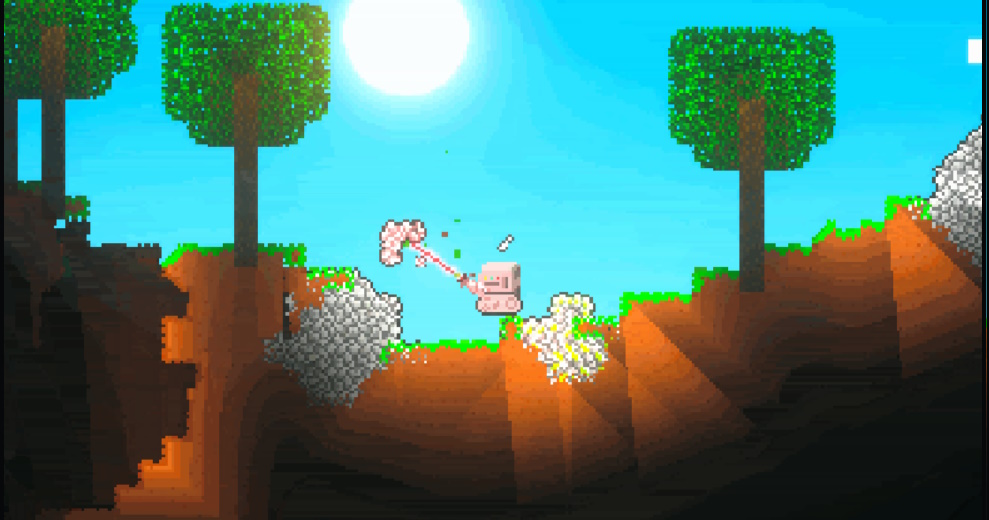
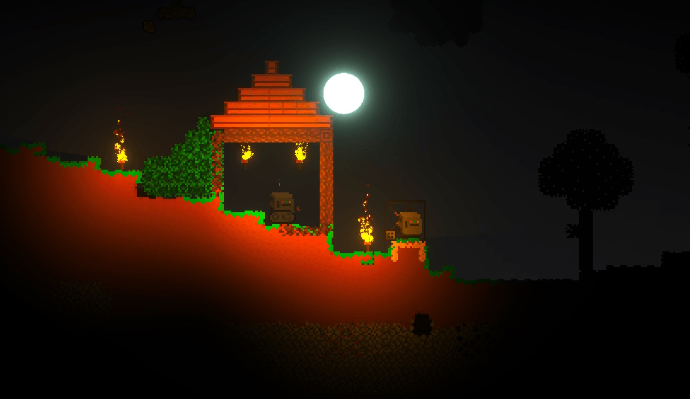
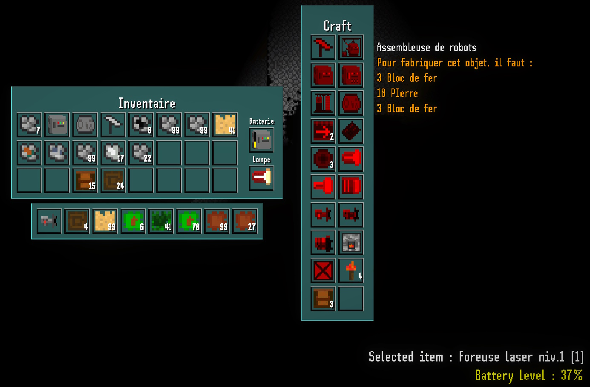
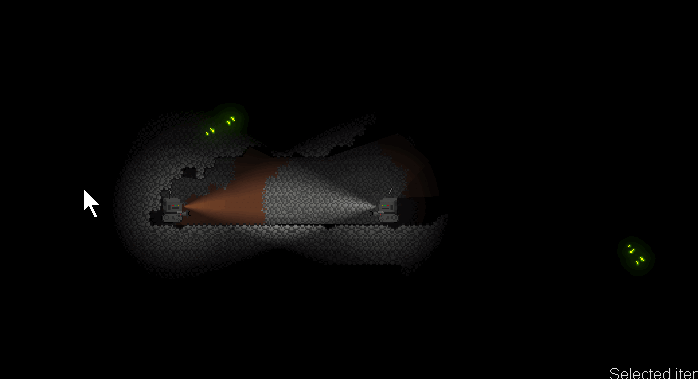

<autotab> <table><thead><tr><th>Date de création</th><th>Finalisation</th><th>Ampleur du projet</th><th>Wow effect</th><th>Type de projet </th><th>En Ligne</th></tr></thead><tbody><tr>
        <td>mai 2021</td>
        <td>juillet 2021</td>
        <td>medium</td><td>cool</td>
        <td>Jeu alpha / incomplet</td><td>NO</td>
        </tr></tbody></table></autotab>

## Description

Jeu de construction et d'exploration.
Le but est de créer une civilisation de robots, leur donner des modules afin qu'il sachent quelle tâche effectuer, et s'expandre dans un environnement.

Réalisé en duo avec [Victoire BUISSET](https://pholith.github.io/Portfolio/).

## Contexte

Inspiration des jeux `Terraria` et `Starbound`.

L'objectif est de créer un jeu en 2D qui serait porté sur les technologies, l'utilisation de ressources, le craft et l'expansion de civilisation dans un univers à découvrir et conquérir. Un concept similaire existait à l'époque en 3D avec `Factorio`, mais pas encore en 2D.

Ce projet ne date pas d'hier, mais il a été laissé à l'abandon pendant de nombreuses années. On a décidé de le reprendre pour un projet scolaire, dans un cours d'introduction au développement de jeux vidéos sur Unity.

## Développement

Le développement a été réalisé à deux developpeurs, en deux phases distinctes.
- La première phase : créer les fonctionnalités de génération de terrain, de déplacement, d'interaction avec l'environnement, ainsi que le design général.
- La deuxième phase un an plus tard : gestion de la lumière et des ombres sur URP, création d'un système de craft, gestion de l'inventaire avec des bases de données d'objet, etc.

**Quelques problèmes**

Pour nous simplifier la vie, j'ai utilisé des packages que j'ai moi-même développé (Packages [**Logiked**]()). Axé pour le dévelopemment de jeu en 2D c'est un ensemble d'outil très efficace. Cependant c'est la première fois que je greffais ces packages à un projet en cours. Beaucoup d'effets de bords on été à prévoir. Il y a aussi beaucoup de fonctionnalités qui se sont avérées incomplètes ou manquantes. Un certain temps à donc été passé à développer les packages Logiked au lieu du jeu lui-même.

Le fait que le jeu soit devenu un projet scolaire, a ammené une contrainte de temps. Cela nous a poussé à avancer le plus rapidement possible, et à laisser des bugs sur notre passage.

## Produit final

Le jeu en l'état est attractif visuellement, et propose de nombreux aspects intéressants. Il reste cependant beaucoup d'erreurs et de bugs redondant qui influent sur l'expérience utilisateur. Ce n'est donc pas un jeu fini en temps que tel, mais un prototype jouable d'un concept encore à développer.

## Ressenti

Fier du rendu visuel et des fonctionnalités. Le développement de mes packages **Logiked** a aussi été mis à l'épreuve. 

Je regrette cependant le nombre de bugs, et l'arrêt du projet avant d'avoir atteint un niveau de gameplay suffisant.

## Mode histoire

<history>

*[Infos en vrac]*

Le concept initial a débuté en DUT avec la développeuse [Victoire BUISSET](https://pholith.github.io/Portfolio/), une collègue régulière de travail. Nous n'avions encore jamais développé de jeu vidéo à deux, et c'était le premier objectif de ce jeu.

Tous deux appréciateur des jeux `Terraria` et `Starbound`, nous trouvions qu'il manquait le côté usine, machines, technologies à développer. Aussi l'idée d'une machine qui produit et/récupère des ressources, qui se déplace, évolue et qui en utilisant les ressources collectées afin de créer d'autres robots et d'expandre son domaine. Le concept similaire existait à l'époque en 3D avec `Factorio`, mais pas encore en 2D. Le jeu `ONI - Oxygen not included` présentait aussi des concepts qui nous intéressait, et sur lesquels Victoire avait déjà de l'expérience (développement préalable de nombreux [mods](https://github.com/Pholith/ONI-Mods)).

Nos objectifs principaux étaient les suivants : un jeu modable, complet, et réaliste.

- RobotIndustry 1.0 : Première version rapidement mise de côté après le design d'un certain nombre de fonctionnalités de base, comme les tile map avec cassage de blocs, la récupération des ressources placées dans un inventaire, les designs principaux des blocs et robots, mais le projet s'arrêtera là pour cette année. Participation de [Baptiste Perrin](https://www.linkedin.com/in/baptiste-perrin77/), notamment au niveau de l'interface graphique.

- RobotIndustry 2.0 : La reprise du projet s'inscrit dans le cadre d'une unité de *Projet d'initiation à Unity* lors de ma première année d'école ingénieure avec Victoire, et inclus quelques packages [**Logiked**]() tel que gestion d'objets dans des bases de données, ainsi que la gestion des animations.
  
  Une grande attention a été portée sur le travail de la lumière sur URP, avec des modes jour/nuit mais le système restait très peu permissif.
  

  

Les fonctionnalités suivantes ont été développéees : poser/installer un bloc, le déposer au sol, les casser et les utiliser dans des crafts par exemple !

Le système de craft reposait sur des recettes de fonctionnement similaire à `Minecraft`, développé par Victoire.

Le jeu fonctionnait aussi dans un univers de semi-survie, où la ressource importante à obtenir était la batterie : en effet, chaque action réalisée tel que sauter, se déplacer allumer ses lumières pour voir la nuit ou dans le sol creusé, utiliser un laser, etc, consommait de la batterie qu'il fallait crafter ou remplir de manière régulière afin d'échapper à la mort du robot.

Malgré un nombre important de bugs, dues principalement à l'impératif de temps qui nous poussait à un développement rapide, le jeu étaient intéressant !

J'ai pu tester et *faire tester* pour la première fois mes packages **Logiked**, ce qui m'a permis d'y apporter nombre de corrections et d'optimisations en pensant à une possible mise en ligne de ces derniers ainsi qu'à une commercialisation éventuelle.

Le projet rendu a été extrêmement bien noté car le résultat était, malgré ses quelques faiblesses, toujours bien meilleur que les attentes des professeurs, ce qui laisse un sentiment positif sur le jeu, et donne envie de peut être continuer son développement un jour !

</history>

<nextprojects>

> Projet précédent -  [Underwar](/Jub_Biography/projects/Unity/Underwar)

> Projet suivant -  [Projet VR ESIEE 
Room 505](/Jub_Biography/projects/Unity/Room505)

</nextprojects>