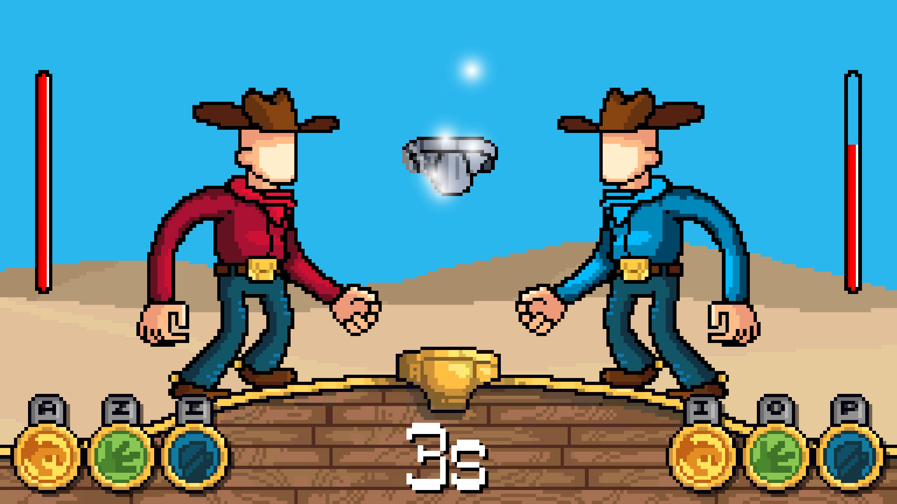

<autotab> <table><thead><tr><th>Date de création</th><th>Finalisation</th><th>Ampleur du projet</th><th>Wow effect</th><th>Type de projet </th><th>En Ligne</th></tr></thead><tbody><tr>
        <td>décembre 2020</td>
        <td>décembre 2020</td>
        <td>small</td><td>epic</td>
        <td>Jeu complet</td><td>YES</td>
        </tr></tbody></table></autotab>

## Description

Underwar est un jeu type pierre-feuille-ciseaux, disponible sur [itch.io](https://logiked.itch.io/underwar). Développé en collaboration avec [Maxime BARON](https://www.linkedin.com/in/maxime-baron-3306881a3/) en tant que graphiste.

## Contexte

L'objectif était de créer un jeu rapidement avec un gameplay simple, similaire aux attendus d'une `Game-Jam`. On est parti sur la même démarche que pour [Chicken Shock Giga Omelette](/Jub_Biography/projects/Unity/ChickenShock_GigaOmelette) : faire un brainstorming, puis partir sur un jeu simple qui amuserait les gens. On à choisis l'univers du tire slip remasterisé en version pierre-feuille-ciseaux. Eh ouais ça cogite.

## Développement

Le jeu a été developpé en seulement 2-3 jours. La chartre graphique a été entièrement créé par [Maxime](https://www.linkedin.com/in/maxime-baron-3306881a3/), les personnages, les décors et les animations. Le reste du développement a été codé par mes soins, interface, mode de jeu à distance, mécaniques et sons.

## Produit final

Underwar peut se jouer sur le même ordinateur en utilisant des parties du clavier différentes, ou en réseau en se rejoignant à distance sur une room commune. Le jeu est coloré et fluide, avec un design très fun et une abiance sonore entraînante. Une version Android à déja été partagé à notre cercle proche, fonctionne trés bien aussi.

## Ressenti

La sensation d'accomplissement a été géniale, pour un développement relativement court ! Underwar est un de nos seuls jeux en ligne qui fonctionne parfaitement pour une démo. On a un petit soucis de conexion pour le mode multijoueur, parfois. Mais quand ca marche, c'est bien optimisé. Les joueurs sont captivés pendant leur découverte de ce jeu simpliste, et il n'est pas rare de voir s'organiser des tournois ou des défis entre les partipants quand on présente le projet à un groupe.

<nextprojects>

> Projet précédent -  [Projet Muinecraft](/Jub_Biography/projects/Unity/Muinecraft)

> Projet suivant -  [Robot industry V2](/Jub_Biography/projects/Unity/Robotindustry)

</nextprojects>
