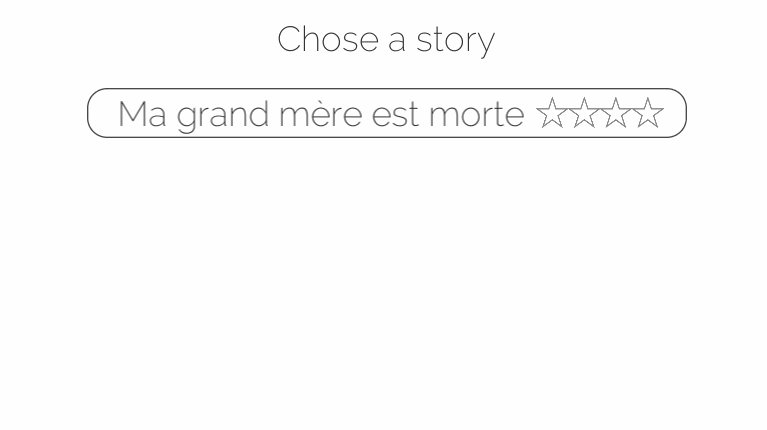
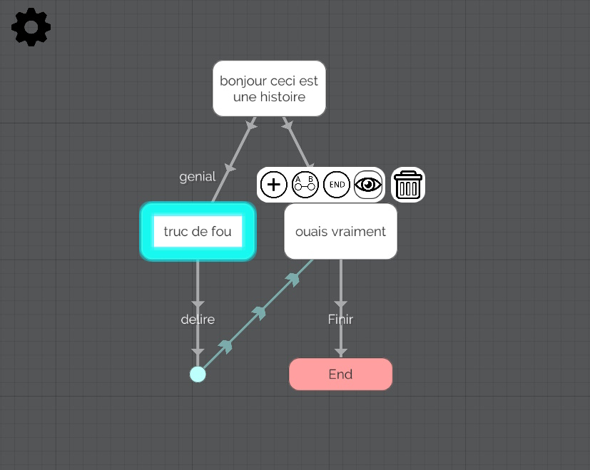

<autotab> <table><thead><tr><th>Date de création</th><th>Finalisation</th><th>Ampleur du projet</th><th>Wow effect</th><th>Type de projet </th><th>En Ligne</th></tr></thead><tbody><tr>
        <td>octobre 2019</td>
        <td>octobre 2019</td>
        <td>small</td><td>cool</td>
        <td>Prototype jouable</td><td>NO</td>
        </tr></tbody></table></autotab>

## Description

L'Historycon, c'est un projet de jeu mobile. Le concept est de pouvoir rédiger des histoires interactives, comme dans *"Le livre dont vous êtes le héro"*. Ces histoires peuvent ensuite êtres joués et publiés afin que d'autres utilisateur puissent les apréciers et les noter.

*Une partie de l'interface du jeu*

## Contexte
Pendant mon DUT informatique, on a eu des cours en base de données SQL. Mettre en place une base de données, des requetes sql... J'ai trouvé tout ca trés simple. Je me suis donc lancé dans ce projet avec pour but de mettre en avant ces connaissance, afin d'avoir une application de partage d'histoires.

## Développement

Le premier élèment que j'ai mis en place aura été l'éditeur d'histoires. On peut y créer des nodes, correspondant à des pages, des transitions depuis une page vers une autre, enregistrer des variables sur le chemin parcouru...

*L'éditeur d'histoires*

Coté gameplay, le jeu étant un prototype, je ne me suis pas foulé pour l'interface. J'ai implémenté des fonctionalités interessantes :
- Pour chaque transitions entre les pages, on peut voir le pourcentage d'utilisateurs qui ont pris le même chemin.
- A la fin on peut noter l'histoire sur 5 étoiles.

## Produit final

Le système fonctionnait plutot bien, mais je me suis vite lassé. Mon attention était tiraillé entre les études et des projets plus gros, tel que [Lack Of Light](/Jub_Biography/projects/Unity/LackOfLight) qui me prenait le plus clair de mon temps. 

<nextprojects>

> Projet précédent -  [Mr. Kata Die It Yoursefl](/Jub_Biography/projects/Unity/MrKata_DieItYoursefl)

> Projet suivant -  [Projet Muinecraft](/Jub_Biography/projects/Unity/Muinecraft)

</nextprojects>
